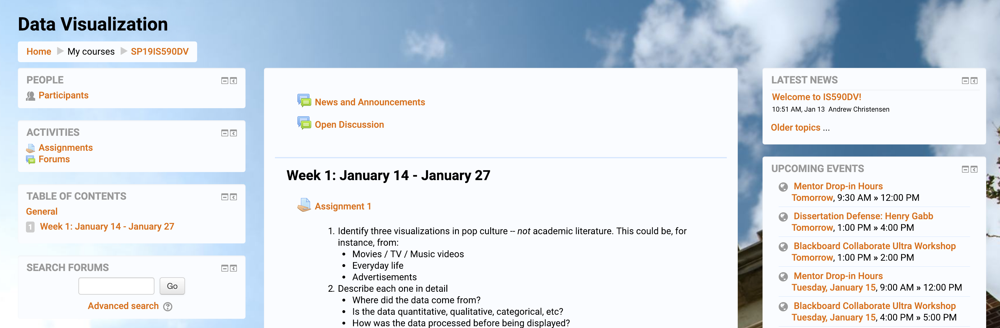
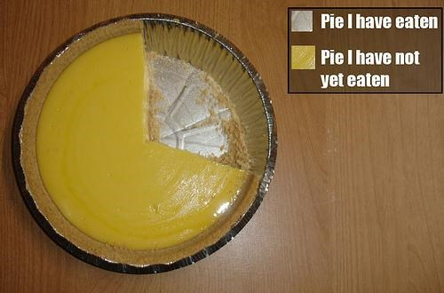
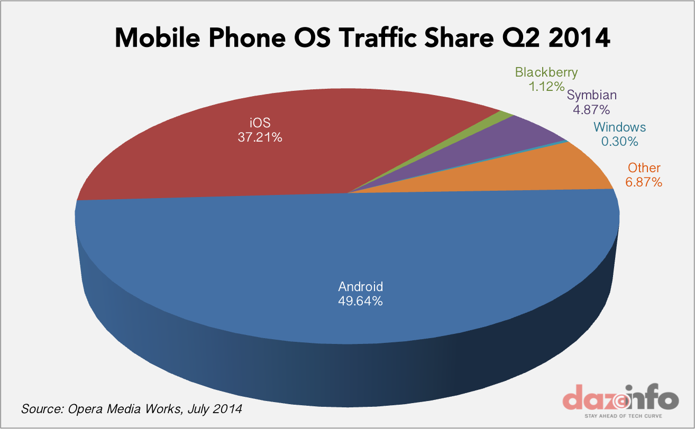

<!-- .slide: class="titleslide" -->

# Data Visualization

## AJ Christensen
## Spring 2019

---
<!-- .slide: class="vertical_center" -->
## Basics

9AM-11:50PM Mondays, 126 iSchool

AJ Christensen - `achrist3@illinois.edu` 
Office Hours: Thursday 10am-12noon, NCSA 2019

TA Arjitha Balaji - `arjitha2@illinois.edu` 
Office Hours: Wednesday 10am-12noon, iSchool TBA
 
TA Krishna Shanker Rajhan - `gs10@illinois.edu` 
Office Hours: Tuesday & Thursday 4pm-5pm, iSchool TBA

https://uiuc-ischool-dataviz.github.io/spring2019/

notes:
just to give you a quick overview of my work at NCSA...

---

<iframe width="1024" height="576" src="https://www.youtube.com/embed/T_0ICxROM0Q" frameborder="0" allow="autoplay" allowfullscreen></iframe>

---

# Terminology

 * Visualization
 * Information Visualization
 * Scientific Visualization
 * Simulation
 * Illustration
 * Scientific Illustration

notes:
visualization goes back to cave men painting star-tracking imagery during the Pleistocene Era

illustration can be motivated by experts as well, but it can be problematic when an audience thinks it's real - which can be especially problematic when the presentation is so well done that it looks photographic.

---

## Timed activity!

On a piece of paper:

* What are the most memorable movies you saw over the last year?
* How would you quantify your experience with programming?
* Do you prefer cats or dogs?
* How many people are in each row in this classroom?

notes:
We're going to use these pieces of data to explore how we might approach
visualization.  Each of these items is a different *type* of data --
qualitative, quantitative, elements drawn from sets, and sets of numerical
data.

Trying to visualize each one will give us a basic idea of how we might think
about these types of data, and how we approach visualizing them.

---

Count off by 9, break into groups, introduce yourselves, and visualize the data you collected by hand or by computer.

notes:
Don't get used to sitting in the same seat in this room!  We're going to move
around and try things, starting with hand-crafting some visualizations.

---

## Download Anaconda!

[anaconda.com/download](anaconda.com/download)

---

## Intake Survey

[goo.gl/7CQi5H](https://goo.gl/7CQi5H)

notes:
This survey will help guide the level of instruction during the course.
Although we will be going over many of these topics, by knowing how well you
are already acquainted with them I can guide the instruction to greater or
lesser detail.

---

## Syllabus

 * Week 1 (Jan 14): Introduction, syllabus, examples, and some basics
 * Week 2 (Jan 28): Operational palette, structured python, and files
 * Week 3 (Feb 4): Quantitative plots, plot components
 * Week 4 (Feb 11): Histograms and distributions
 * Week 5 (Feb 18): R and ggplot
 * Week 6 (Feb 25): Images: color, colormaps
 * Week 7 (Mar 4): Comparisons between datasets

notes:
This is a rough syllabus!  These are many of the topics we will cover, but
based on how the course proceeds and how folks respond, we may shorten or
lengthen different topics.

The organization here is designed to start out slow, dealing with how to
program python for visualization, understanding how data is laid out, which
operations we can apply to that data, and then moving on to representing data
in different ways.

---

## Syllabus

 * Week 8 (Mar 11): Comparisons between different datasets
 * Week 9 (Mar 25): Network visualization
 * Week 10 (Apr 1): Principles of interactive visualization
 * Week 11 (Apr 8): Interactive visualization with Python
 * Week 12 (Apr 15): Scientific visualization
 * Week 13 (Apr 22): Advanced topics
 * Week 14 (Apr 29): Group presentations

notes:
Toward the end of class we are going to have a slightly more free-form set of
discussion points.  Your final projects will be somewhat open-ended, requiring
more group work and collaboration than the preceding assignments.

---

# Class Mission

While you are already a _consumer_ of visualizations, your perspective should change to that of a _producer_ of visualizations. You should be comfortable reading AND writing imagery.

notes:
We will be discussing this as the semester goes on, but the principal outcome I
want you to take away from this class is understanding how to transform data
into its visual representation, and to take that understanding with you as you
observe visualizations presented to you.

By developing visualizations, you will grow to understand the choices that
influence those visualizations, and you will bring that with you while
consuming information visually.

---

# The Things I Want You To Take Away

 * You should know the basics of how to manipulate data -- aggregations,
   filterings, and other operations.
 * I want you to know _some_ of the packages that are out there to visualize
   data.  These will mostly be Python-based, with a couple in Javascript.
 * You won't learn how to use dashboarding software (e.g. Tableau) in detail. Instead, we
   will focus on the different operations that go into dashboarding software.
 * By the end of the course, you will have had the opportunity to look at and
   build visualizations in several different domains and understand how to
   interpret, critique and improve them.

notes:
This course *will* teach you some things about how to code, how to build
visualizations, but we're going to focus much more on learning about how to
construct visualizations and why we make the choices that we do.  If we choose
one way to present data, does that convey information more readily?  Or does it
get in the way of the underlying meaning?

---

## Overview - Themes and Goals

1. What are the components of an effective visualization of quantitative data?
1. What tools and ecosystems are available for visualizing data?
1. What systems can be put in place to generate visualizations rapidly and with high-fidelity representation?

---

## Structure of Class

 * Topic introduction and lecture (60-90 minutes)
 * Hands-on, collaborative coding
 * Wrap-up

You will each be assigned to a group to do collective note-taking on Moodle starting in Week 2. The day
before class each week, you will be notified that you will be taking notes the
next day and you will be provided the link to a collaborative document.
Following the lecture, your notes will be added to the course website.

notes:
This might be updated slightly. Keep an eye on your inbox.

This structure will likely be deviated from during the course, but in general
we will start with lecture, take a break, then continue with collaborative or
hands-on exercises using group coding.

During the group coding, I might lead the class in some visualization in
Python, Javascript, or something else.  During this section, I expect that
students will *follow along* with what is going on -- typing in the specific
commands, and maybe even trying different things as we go.  It is not meant to
simply be a "performance" of coding, but instead an opportunity to learn.

---

## Grading

 * 70% Weekly assignments in prose or code form
 * 30% Final project

notes:
Your weekly assignments will take different forms.  The first assignment will
be exclusively prose and hand-writing, but subsequent assignments will be
either notebook (coding) based or prose-based as well.

The final project will be described later in class, but will take the form of a
group project that touches on coding as well as visual design.

---

## Assignments

 * Weekly, assigned in class, collected following class
 * Prose assignments: deconstruction or analysis of a visualization or a dataset.
 * Coding assignments: Jupyter notebooks following step by step through
   collection and processing of data and the visualization of that data

---

## Plagiarism

 * Plagiarism is about copying ideas.
 * Cite all code you utilize from elsewhere.

notes:
When programming, I expect that you will do things like search on the internet
to find help with a given problem.  This is fine.

But, you *must* cite where any code snippets came from.  And you *must* note if
you are working with other people in the group!

Using snippets of code is fine -- but you may not copy large-scale amounts of
code from other work (for example, other visualizations) and pass it off as
your own.  Always cite, and be reasonable in what you utilize.

---

## Our tools

 * Python, with some R and Javascript along the way
 * Jupyter and Jupyter notebooks on a Jupyterhub
 * The occasional usage of a shell such as bash
 * Once in a while some git, and GitHub
 * Slack

notes:
You will be expected to write code in Python, and to learn the very basics of
Javascript.  Your projects may be turned in via git.  We will also utilize
Slack for class communication.

---

notes:
Jupyterhub is a software system for launching multiple independent notebooks
that can share access to data and installed software.  Ours is administered by
the iSchool.

---

## Jupyterhub Guidelines

 * [jupyterhub.ischool.illinois.edu](https://jupyterhub.ischool.illinois.edu/)
 * Please store your notebooks on- and off-site
 * Data will be available at `/home/shared/spr19-is590dv/data/`
 * Previous lectures will be in `/home/shared/spr19-is590dv/spring2019/`
 * You will have access to conda, etc, but I may rebuild images to add packages.

notes:
It is possible that your JupyterHub instance may be lost -- don't store mission
critical data there without a backup.  It should be possible to share data
between people on the system, but I won't pretend to know the right way to do
that.

---

## Assignment Flow

 1. Instructor "releases" an assignment
 1. Assignment appears in student "Assignments" tab
 1. Students "fetch" assignment, which copies it to their work directory
 1. When done, students "submit" assignment, which copies it to the
    instructor’s inbox
 1. Grades and feedback will be posted on Moodle.

notes:
You can look at this on the course website if you want to get a jump start, but we won't be using JupyterHub for the first week so I'm skipping for now.

---

## Moodle
[https://courses.ischool.illinois.edu/course/view.php?id=3643](https://courses.ischool.illinois.edu/course/view.php?id=3643)

---

## Submission Format:
 * Prose assignments submitted as a narrative document in PDF file format (to be read by a human). 
  - Figures and tables should be embedded into the document near their first mention
  - Supplementary files containing code or data should be referenced in the text and separately uploaded.
  - Include the name and netid of every contributor at the beginning of the document.
 * Code assignments submitted as a Jupyter notebook in IPYNB file format.
  - DO NOT delete lines of unused code.
  - Any supplementary files containing data should be described in code comments and separately uploaded.
 * All uploaded files should be in the format: lastname-firstname-assignment#.ext
  - e.g. christensen-andrew-assignment1.pdf

---

## Slack

 * Team is at `is590dv-spring2019.slack.com`
   * `#general` : General announcements
   * `#assignments` : Help with assignments
   * `#help` : General help with Python, Javascript, visualization, etc
   * `#_classroom-lectures` : During lectures, post links, comments, questions here
 * Use the `@` sign appropriately: `@[person]`, `@here`, `@channel`
 * Web client, standalone client and mobile devices can access this team.
 * At the end of the semester, the team will be discontinued.
 * Please think carefully before direct messaging if you could ask in a public
   forum instead.
 * Conduct will be held to same standards as any educational venue.

notes:
We will be sharing the slack with the online course, so you can share thoughts with students not in this room as well for a wider variety of perspectives.

Please use slack as much as you need!  You can use it to share items and
articles with the class, to collaborate, to discuss and ask questions and get
feedback.  However, please do behave in a professional fashion.

---

## Github

 * Course repo is at [UIUC-iSchool-DataViz/spring2019](https://github.com/UIUC-iSchool-DataViz/spring2019/)
 * Automatically built to [uiuc-ischool-dataviz.github.io/spring2019/](https://uiuc-ischool-dataviz.github.io/spring2019/)
 * Lecture notes will be placed there, and available in your JupyterHub
   instances in `shared/sp19-is590dv/spring2019`
 * Copy the notebooks to your directory before using them.
 * Supplemental materials can be found at [UIUC-iSchool-DataViz/support-files](https://github.com/UIUC-iSchool-DataViz/support-files)

notes:
All the materials for this course will be stored in github, and are available
under a very permissive license.  It is largely written in markdown and
automatically compiled to web pages when changes are made.

You are invited to clone the repo, fork and submit changes (typos, etc!), and
to use any information in it in the future.

---

## This week

 * Why do we visualize?
 * What types of data do we visualize?
 * How do we visualize?

notes:
We're going to start out at a very high-level, discussing why we choose to
visualize versus other types of representation, what types of data, and how we
might do it.

---

# Why?

(Or rather, why _wouldn't_ we visualize?)

notes:

---

<iframe width="1024" height="576"
src="https://www.youtube.com/embed/In72QAQJ1tY?rel=0" frameborder="0"
allow="encrypted-media" allowfullscreen></iframe>

notes:
The previous instructor of this course left me with this example of one thing not suited to visualization...

Not everything suits itself to visualization -- and part of the reason for that
is the necessary reductionism that visualization can require.

---

<!-- .slide: data-background-image="images/fov.svg" data-background-size="contain" -->

notes:
Human perception is biased by the tools we have to work with - our senses and our minds.

Visual information is communicated through our eyes, which have limitations. At
the most basic level, we can see a range of about 210 degrees horizontally with
one or both eyes.  The region that is covered by both ("binocular") is about
114 degrees in extent.

You can only cram so much information into the human eye.

---

By Vanessa Ezekowitz [CC BY-SA 3.0](https://creativecommons.org/licenses/by-sa/3.0), via Wikimedia Commons

notes:
When we think about visual communication of information, we *must* think about
how human physiology interacts with those visuals.

Also, fair warning: I'm not a medical doctor.

This diagram shows the visual acuity of a "standard" human eye, as a function
of angular distance from the fovea.  We have to think about this in
*conjunction* with our field of view.

---

## I need a volunteer!

notes:
What's your name?

(This part is a bit of a stunt.  Sorry.)

---

*Read these numbers aloud:*

| | |
|:-|-:|
| 2007-01-01 | 14233.2 |
| 2007-04-01 | 14422.3 |
| 2007-07-01 | 14569.7 |
| 2007-10-01 | 14685.3 |
| 2008-01-01 | 14668.4 |
| 2008-04-01 | 14813.0 |
| 2008-07-01 | 14843.0 |
| 2008-10-01 | 14549.9 |
| 2009-01-01 | 14383.9 |

---

notes:
Now you can see the bump in the data. It's much clearer than focusing on the numbers right?

You might immediately notice a few things about this image, but one item that
we will talk about as class goes on is that often visualizations can have a
consistent style. Often this can be associated with a professional brand identity. FRED in particular has a "branding" that is quite obvious,
even without the logo.

---

# Who are you visualizing for?

* For yourself?
* For a peer?
* For the public?

notes:
*Whenever* you build a visualization you need to think about the context that you can assume on the part of your viewer. For instance, in my work at the NCSA, we focus on outreach to the public, which might include children, or politicians, OR expert scientists, so our visualizations have to be fairly approachable and movie-like. But some of my visualization colleagues at the NCSA work specifically with scientists, and their visualizations might be highly complex with lots of annotation and specific numerical values.

---

# Tenet 1:

"Visualizing data" is not a strict subset of "making an image."

notes:
Much of the visualization process is data processing, which is less subjective than a lot of image making.

---

 * Collection of the data
 * Organization of that data
 * Representation of that data

notes:
We will approach visualization as a multi-stage process of data
collection, organization and representation.

---

# Tenet 2:

We tell lies to visualize, but we _must_ be honest.

---

### "The Principle of Proportional Ink" - callingbullshit.org

notes:
So let's first talk about how misleading visualizations can be. This 3D pie chart violates the "principle of proportional ink" which states that the number of pixels that represent a value should be proportional to the value. With the raised edge on the pie chart, the blue wedge gets way more ink than it deserves and you get a disproportionate sense of value.

---

### "Spurious Correlations" - tylervigen.com

notes:
you can have a lot of absurd fun with data - but when data is presented in a visualization, people often believe the authority of it even if it's outlandish. 
Side note: This guy has some good ideas of where to find sample datasets for upcoming homework assignments too!

---

<!-- .slide: data-background-image="images/barCharts.png" data-background-size="contain" -->

notes:
Each of these bar chart examples are meant to show the same data. But you can see how they're a bit problematic.

---

<!-- .slide: data-background-image="images/gunDeaths.jpg" data-background-size="contain" -->

notes:
Now here's an example that's more brazen. I'll give you a minute to analyze this and tell me what's wrong with this graph.

Some people will claim the Y-axis should always start from the bottom - at zero - to avoid confusion.

---

<!-- .slide: data-background-image="images/keelingCurve.svg" data-background-size="contain" -->

notes:
however, the Keeling Curve is an interesting counter-argument. This is the famous graph that was the original evidence for global warming, showing the rate at which atmospheric carbon dioxide was growing. 

Does anyone know why it's generally accepted to show the y-axis like this, without it starting at the zero axis?

---

<!-- .slide: data-background-image="images/hearts_battery.svg" data-background-size="contain" -->

---

<!-- .slide: data-background-image="images/battery.svg" data-background-size="contain" -->

 1. Sensors read the current "fill" of the battery
    * Batteries are analog - must be converted to digital representation
    * Normalized with respect to the expected "full"
 1. This is then scaled to a percentage
 1. The battery image is filled from left to right
 1. The image is then designed as a glyph, rasterized, and displayed

---

<!-- .slide: data-background-image="images/hearts_bw.svg" data-background-size="contain" -->

 * Some fixed maximum amount of health
 * Each time damage is taken, decrement
 * Each time health is received, increment
 * Display number of hearts as appropriate

---

2 out of 3 "points"

<!-- .slide: data-background-image="images/hearts_color.svg" data-background-size="contain" -->

---

<!-- .slide: data-background-image="images/hearts_color.svg" data-background-size="contain" -->

---

<!-- .slide: data-background-image="images/stitch_bg.png" data-background-size="contain"-->

notes:
This is a screenshot from the movie "Lilo and Stitch" where the little girl Lilo is graphing how much evil is in the alien Stitch. It borrows from a familiar visual - the thermometer. But how could this visualization be misinterpreted? How is it different from a thermometer?

---

<!-- .slide: data-background-image="images/stitch_nobg.png" data-background-size="contain"-->

notes:
The angle can be misleading. So can the relative width of the head vs the feet. The surface area is not consistent from top to bottom. Also there are empty areas in the mouth and eyes!

---

<!-- .slide: data-background-image="images/stitch_nobg_tilted.png" data-background-size="contain"-->

notes:
If we rotate the image so that the red liquid is level, do we get a different impression for how much bad is in Stitch?

---

<iframe width="1024" height="576"
src="https://www.youtube.com/embed/D-uBv6jB7r0" frameborder="0"
allow="autoplay; encrypted-media" allowfullscreen></iframe>

notes:
How could this visualization be misleading? What about the camera move? What about the colors used? Are there actually several distinct layers of shells or is this a continuous volume?

---

## Honesty

Our choices must be:

 * Deliberate
 * Informed
 * Motivated
 * Justifiable

---

## Election Maps

Mark Newman of the University of Michigan has created visualizations of the
election maps from several of the most recent elections.  For more information
and context, see his page http://www-personal.umich.edu/~mejn/election/2008/ .

 * [Map 1](http://www-personal.umich.edu/~mejn/election/2008/statemapredbluer1024.png)
 * [Map 2](http://www-personal.umich.edu/~mejn/election/2008/statepopredblue1024.png)
 * [Map 3](http://www-personal.umich.edu/~mejn/election/2008/countymapredbluer1024.png)
 * [Map 4](http://www-personal.umich.edu/~mejn/election/2008/countymappurpler1024.png)
 * [Map 5](http://www-personal.umich.edu/~mejn/election/2008/countycartpurple1024.png)

notes:
These are great, but some criticisms might be that the color red is more apparent to the human eye than the color blue. And in the population-to-area adjusted maps, it's difficult to read for people used to geographic accuracy.

---

## This week: Wrap-up

 1. We visualize to change how we understand things.
 1. We visualize data for ourselves, for our peers, and for others.
 1. Visualization is a series of steps that we take to produce a different
    representation of data.

---

## Assignment 1

 * Identify three visualizations in pop culture -- *not* academic literature.
   This could be, for instance, from:
   * Movies / TV / Music videos
   * Video Games
   * Theme parks
   * Advertisements
 * Describe each one in detail
   * Where did the data come from?
   * Is the data quantitative, qualitative, categorical, etc?
   * How was the data processed before being displayed?
   * What method was used to display that data?
 * Replicate the visualization with different, but similarly “shaped,” data
   * By hand is acceptable
   * Computational methods should include source code

---
