<!-- .slide: class="titleslide" -->

# Data Visualization
<div style="height: 6.0em;"></div>
## AJ Christensen
## Spring 2019
## Lecture 3

---

## Warm-Up Activity

1. What is the visualization trying to show?
1. What are its methods?
1. What are the strengths / weaknesses?

https://projects.fivethirtyeight.com/mortality-rates-united-states/

---

## Today's Topics

 * How does drawing work?
 * Operational Palette: Mutations
   * Histograms and aggregations
   * Splitting
 * Elements of a visualization

---

## Drawing

How do we draw an image?

---

## Displays

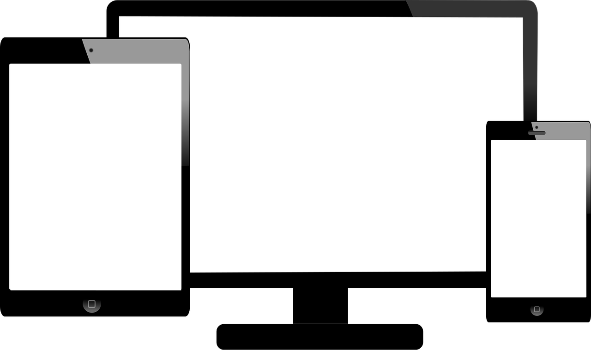

notes:
all modern displays are grids of pixels - pixel literally means "picture element". We divide the whole image into discrete pieces. 

---

<iframe width="1024" height="576"
src="https://www.youtube.com/embed/qfDxiVpgjiM" frameborder="0"
allow="autoplay; encrypted-media" allowfullscreen></iframe>

Link: https://www.youtube.com/watch?v=qfDxiVpgjiM

notes:
There was an age of vector displays, but it seemed limited in utility.
Atari 1983 Star Wars video game
Vector monitor similar to oscilloscope - CRT electron beam follows mathematically defined path.

---

<iframe width="1024" height="576" src="https://www.youtube-nocookie.com/embed/crBo7voJTgY?rel=0" frameborder="0" allow="accelerometer; autoplay; encrypted-media; gyroscope; picture-in-picture" allowfullscreen></iframe>

Link: https://www.youtube.com/watch?v=crBo7voJTgY

notes:
This does have the fun effect that you can actually run some of these on oscilloscopes!

---

## Let's draw a line.

<!-- .slide: data-background-image="images/line.svg" data-background-size="auto 65%" data-background-position="right 10% bottom 50%"-->

---

## Let's draw a line.

<!-- .slide: data-background-image="images/line.svg" data-background-size="auto 65%" data-background-position="right 10% bottom 50%"-->

```
start = (x0, y0)
end   = (x1, y1)
width = 1.0
```
<!-- .element: class="left_abs" style="width: 50%"-->

notes:
you can see a line is basically 5 bytes in memory - one byte for each integer end point coordinate, and one byte for the width.

---

## Let's draw a line.

Convert to an 8x8 image.

<!-- .slide: data-background-image="images/line_grid.svg" data-background-size="auto 65%" data-background-position="right 10% bottom 50%"-->

---

## Let's draw a line.

Convert to an 8x8 image.

<!-- .slide: data-background-image="images/line_grid_fill.svg" data-background-size="auto 65%" data-background-position="right 10% bottom 50%"-->

---

## Let's draw a line.

Convert to an 16x16 image.

<!-- .slide: data-background-image="images/line_grid_fine2.svg" data-background-size="auto 65%" data-background-position="right 10% bottom 50%"-->

---

## Let's draw a line.

Convert to an 16x16 image.

<!-- .slide: data-background-image="images/line_grid_fine2_fill.svg" data-background-size="auto 65%" data-background-position="right 10% bottom 50%"-->

---

## Let's draw a line.

Convert to an 32x32 image.

<!-- .slide: data-background-image="images/line_grid_fine4.svg" data-background-size="auto 65%" data-background-position="right 10% bottom 50%"-->

---

## Let's draw a line.

Convert to an 32x32 image.

<!-- .slide: data-background-image="images/line_grid_fine4_fill.svg" data-background-size="auto 65%" data-background-position="right 10% bottom 50%"-->

---

## Representations

 1. Numerical Data
 2. ???
 3. Pixels On Screen

---

## Representations

We will concern ourselves with understanding two representations of an image:
the **raster** representation and the **vector** representation.

---

## Representations: raster

 * Each pixel is represented as a color
 * Common file formats such as GIF, JPG, PNG
 * Compression can be lossy (JPG) or lossless (PNG)
 * Common Editors: Paint, Photoshop

In a raster image, you describe precisely what to display.

---

## Representations: vector

 * Each component is defined as a "drawing" component, or some action to be
   taken by the rendering engine.  This can include paths, patterns,
   shapes, and text.  Components have properties associated with them.
 * Common file formats are SVG, PDF, EPS
 * The display does not exist until it is "rendered."
 * Options for compression include (lossless) text compression, although
   the rendering engine can simplify display
 * Common Editors: Illustrator, Inkscape

---

## Representations

1 line (uncompressed, single precision)</br> 
 * x0, y0, x1, y1, width </br>
 * 5 bytes </br>
 * 40 bits </br>

1 pixel (uncompressed, singe bit-depth)</br>
 * 1 bit

If a line covers fewer than 40 pixels, raster is less memory than vector

notes:
keep in mind, compression algorithms can make these comparisons a little fuzzier

---

## Representations

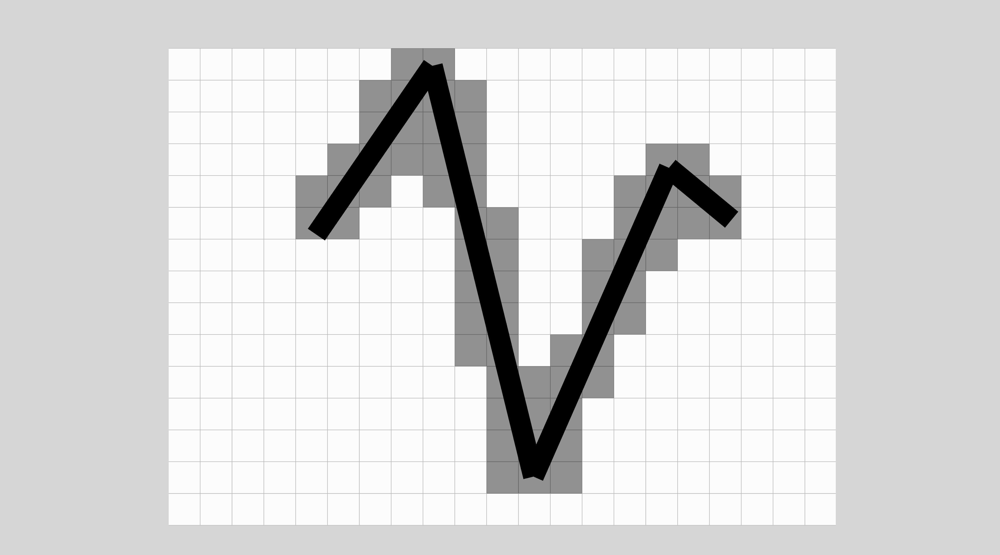

notes:
in this image, all the lines ARE less than 40 pixels

---

## Representations

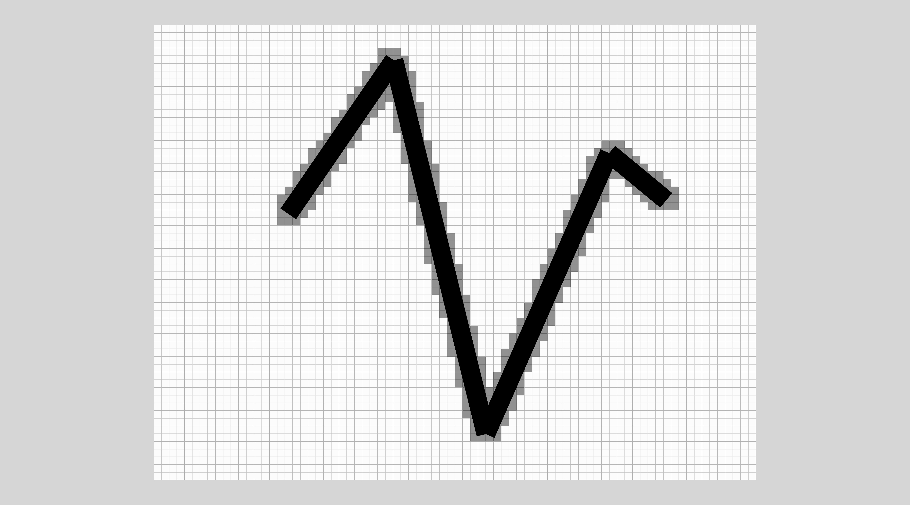

notes:
but in this image, the lines aren't. What's the difference? 

The difference is the ratio of the size of the lines to the raster resolution.

---

## Representations

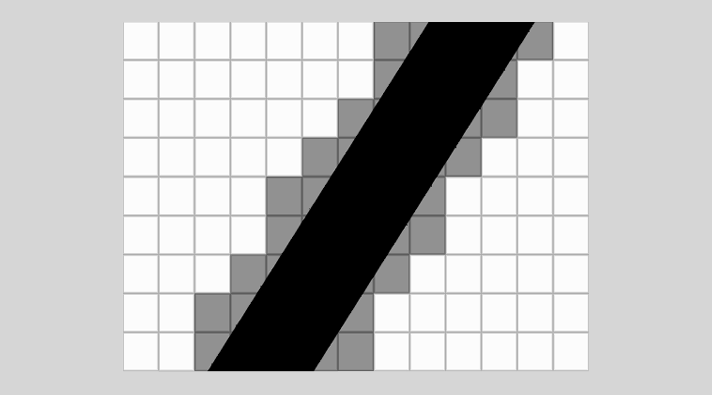

notes:
and now we're back to less than 40 pixels per line. But what changed? Not the resolution.

Now most of the line goes off the screen. We haven't changed the coordinates, we've just zoomed in.

Raster data discards any information outside of the domain. Vector data preserves all information, regardless of boundaries.

---

## Raster Representation

| | | | | |
|-:|-|-|-|-|
| | 1 Line | 10 Lines | 1000 Lines | 1e6 Lines |
|`600x600` | 45kb | 45kb | 45kb | 45kb |
|`1200x1200` | 180kb | 180kb | 180kb | 180kb |
|`2400x2400` | 720kb | 720kb | 720kb | 720kb |

(uncompressed, 1-bit images)

600 x 600 = 360,000 bits / 8 = 45,000 bytes = 45 kilobytes

notes:
You can see that regardless of the number of shapes, the image size stays the same

---

## Vector Representation

| | | | | |
|-:|-|-|-|-|
| | 1 Line | 10 Lines | 1000 Lines | 1e6 Lines |
|`600x600` | 5 bytes | 50 bytes | 5kb | 5mb |
|`1200x1200` | 5 bytes | 50 bytes | 5kb | 5mb |
|`2400x2400` | 5 bytes | 50 bytes | 5kb | 5mb |

(uncompressed, single precision)

notes:
Now no matter the image size, the shape data stays the same size. You can see that with a large number of shapes, the raster representation becomes smaller.

---

## Let's draw a circle.

<!-- .slide: data-background-image="images/single_circle.svg" data-background-size="auto 65%" data-background-position="right 10% bottom 50%"-->

```
center = (x0, y0)
radius = 1.0
```
<!-- .element: class="left_abs" style="width: 50%"-->

---

## Let's draw many circles.

<!-- .slide: data-background-image="images/dots.svg" data-background-size="auto 65%" data-background-position="right 10% bottom 50%"-->

---

## Let's draw many circles.

<!-- .slide: data-background-image="images/dots_grid.svg" data-background-size="auto 65%" data-background-position="right 10% bottom 50%"-->

---

## Let's draw many circles.

<!-- .slide: data-background-image="images/dots_grid_fill.svg" data-background-size="auto 65%" data-background-position="right 10% bottom 50%"-->

---

## Let's draw many circles.

<!-- .slide: data-background-image="images/dots_grid_fine2.svg" data-background-size="auto 65%" data-background-position="right 10% bottom 50%"-->

---

## Let's draw many circles.

<!-- .slide: data-background-image="images/dots_grid_fine2_fill.svg" data-background-size="auto 65%" data-background-position="right 10% bottom 50%"-->

---

## Let's draw many circles.

<!-- .slide: data-background-image="images/dots_grid_fine4.svg" data-background-size="auto 65%" data-background-position="right 10% bottom 50%"-->

---

## Let's draw many circles.

<!-- .slide: data-background-image="images/dots_grid_fine4_fill.svg" data-background-size="auto 65%" data-background-position="right 10% bottom 50%"-->

---

## Raster Representation

| | | | | |
|-:|-|-|-|-|
| | 1 Circle | 2 Circles | 1000 Circles | 1e6 Circles |
|`600x600` | 45kb | 45kb | 45kb | 45kb |
|`1200x1200` | 180kb | 180kb | 180kb | 180kb |
|`2400x2400` | 720kb | 720kb | 720kb | 720kb |

(uncompressed, 1-bit images)

---

## Vector Representation

| | | | | |
|-:|-|-|-|-|
| | 1 Circle | 2 Circles | 1000 Circles | 1e6 Circles |
|`600x600` | 3 bytes | 6 bytes | 3kb | 3Mb |
|`1200x1200` | 3 bytes | 6 bytes | 3kb | 3Mb |
|`2400x2400` | 3 bytes | 6 bytes | 3kb | 3Mb |

(uncompressed, single precision)

---

## Raster or Vector?

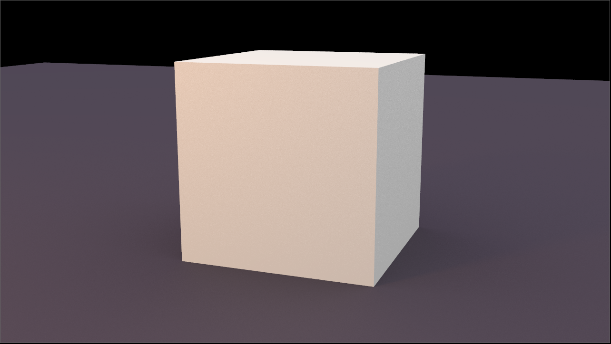

8 points
2.96 kb

notes:
Would it be easier to store this cube as a vector or as raster?
This is larger than a few bytes because it's storing other useful values in CG software.

---

## Raster or Vector?

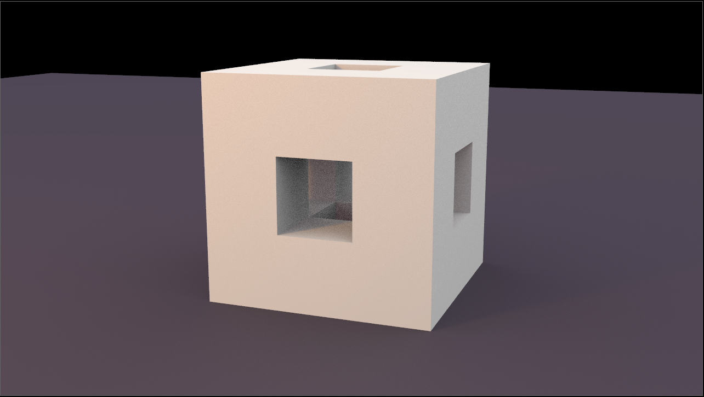

160 points
12.28 kb

notes:
Does this change it?
This is a recursive shape known as a Menger Sponge. Each cube keeps getting replaced with the whole previous shape.

---

## Raster or Vector?


3200 points
445.05 kb

notes:


---

## Raster or Vector?

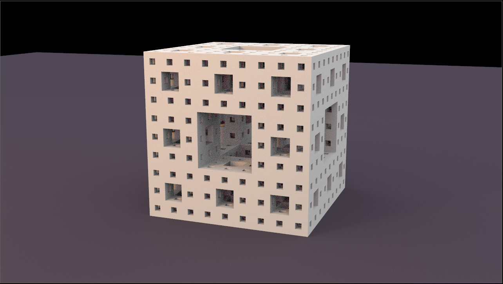

64000 points
9.59 mb

notes:
Does it make a difference yet?

---

## Raster or Vector?

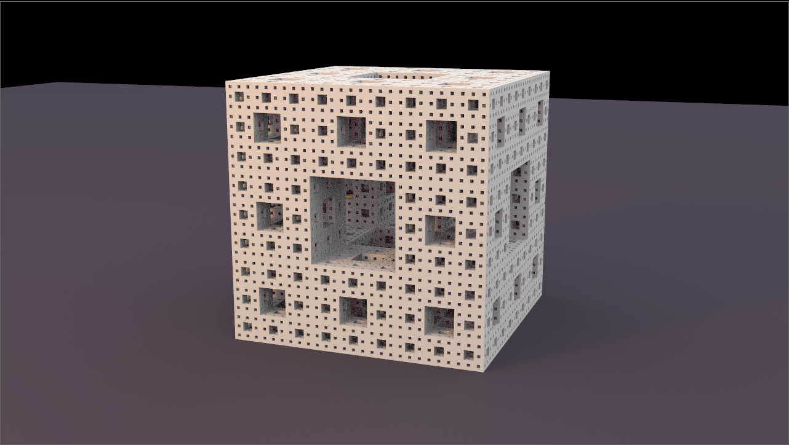

1.28M points
190.93 mb

notes:


---

## Raster or Vector?


25.6M points
3.73 gb

notes:


---

## Raster or Vector?


25.6M points
3.73 gb

1280 x 720 = 921600

notes:
There are 25 times more points than pixels, and most of the pixels don't include the shape.


---

## Infinite resolution

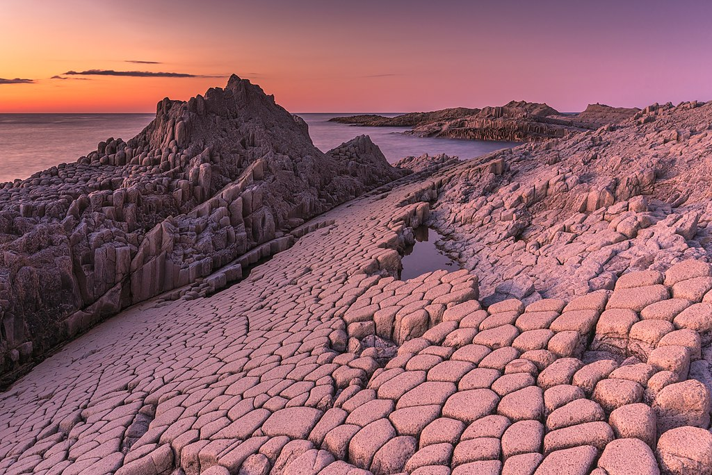

notes:
nature has effectively infinite resolution, down to the atom.
It's much easier to discretize this scene to the level of pixels than to try to use vector shapes to describe everything happening in the photo.

photo by  Ekaterina Vasyagina

---

## Text

Modern fonts are composed of glyphs defined by functional forms of their shape.
Font rendering engines such as freetype2 can generate bitmaps for fonts
rendered at specific resolutions.

---

## Text

Modern fonts are composed of glyphs defined by functional forms of their shape.
Font rendering engines such as freetype2 can generate bitmaps for fonts
rendered at specific resolutions.

In raster image file formats, fonts do not need to be embedded: the rasterized,
rendered version is the one that is transmitted to the viewer.

---

## Text

Modern fonts are composed of glyphs defined by functional forms of their shape.
Font rendering engines such as freetype2 can generate bitmaps for fonts
rendered at specific resolutions.

In raster image file formats, fonts do not need to be embedded: the rasterized,
rendered version is the one that is transmitted to the viewer.

In vector file formats, fonts can either be embedded (in whole or in part) or
fallback fonts available to the rendering engine can be used.

---


---

## Text

fontScript.ipynb

notes:
let's take a look at the script we used to make this!

---

## Geographical Data

Which of these are better represented as raster or vector?
 1. State Boundaries
 2. Relief (height) Map
 3. Population Density
 4. Capitol Cities

notes:
a simple cheat is anytime you see the word "density", it's easier to represent with raster.

---

## Discussion Time

In your groups: can you come up with a few situations in which a raster
representation is "obviously" better and a few in which a vector representation
is "obviously" better?

Some things to consider: 

 * Where is it being displayed?
 * How is the image being transmitted, and what concerns are there?
 * What is in the image?

---

## Visualization Palette

This week we will discuss "mutation" of data.

---

## Mutation Operations

 * Mathematical operations, such as injective operations.
   * Logarithmic versus linear representations
   * Arithmetic or multiplicative relationships
   * Dimensionality remapping
 * Smoothing (reduction)
 * Histograms (reduction)

notes:
remap dimensions like inches to centimeters. Or height to body mass index. Not always a direct relationship.

smoothing and histograms are only mutations if we change the number of data points (reduction). If we keep the existing points in a one-to-one (injective) way, we're not running a mutation.

---

## Histograms

What can we understand from these plots?

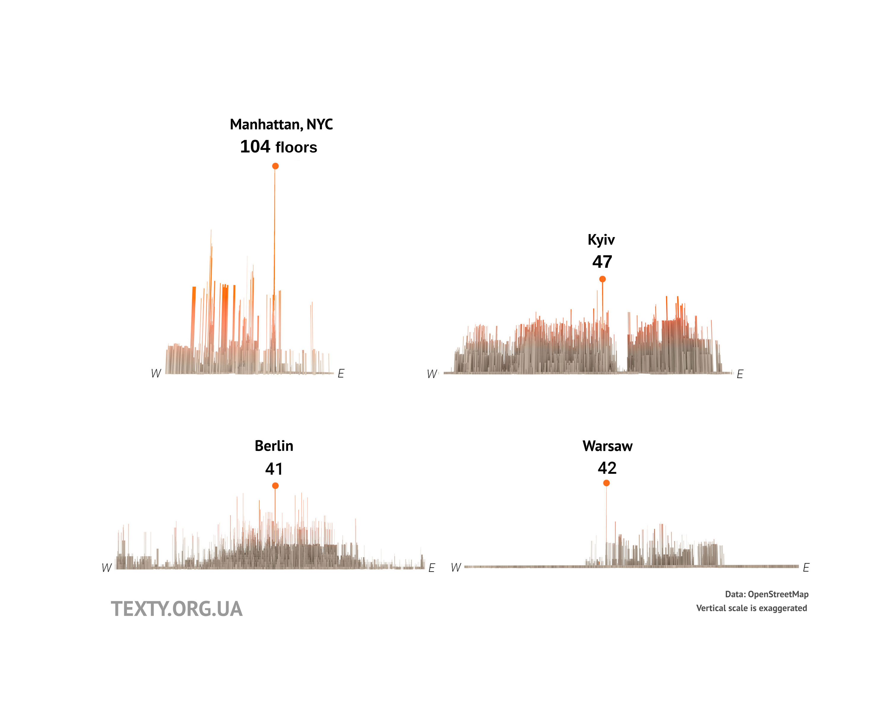

notes:
What can we understand from this visualization?

---

## Histograms

What can we understand from this plot?

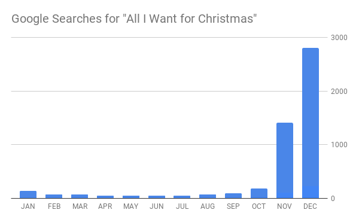

notes:
What can we get from this one?

---

## Binning and Histograms

<!-- .slide: data-background-image="images/circles.svg" data-background-size="auto 65%" data-background-position="right 10% bottom 40%"-->

<div style="width: 50%">
We can aggregate data points according to their position along defined
dimensions.
</div>

---

## Binning and Histograms

<!-- .slide: data-background-image="images/circles_grid.svg" data-background-size="auto 65%" data-background-position="right 10% bottom 40%"-->

<div style="width: 50%">
We can aggregate data points according to their position along defined
dimensions.
</div>


---

## Binning and Histograms

<!-- .slide: data-background-image="images/circles_grid_filled.jpg" data-background-size="auto 65%" data-background-position="right 10% bottom 40%"-->

* $\Sigma 1$ (count)
* $\Sigma v_i$ (sum)
* $\frac{\Sigma v_i }{ \Sigma 1}$ (average)
* $\frac{\Sigma v_i w_i}{\Sigma w_i}$ (weighted average)

notes:
vi means the value of something, wi is the weight of "importance" of the thing. So a bin can have a larger value by having a higher vi or wi.

let's imagine each data point here is a building owned by the state of Illinois

---

## Binning and Histograms

<!-- .slide: data-background-image="images/circles_grid_histogram_count.jpg" data-background-size="auto 65%" data-background-position="right 10% bottom 40%"-->

* $\Sigma 1$ (count)

notes:
Here we are asking, how many data points are there in each bin. Perhaps the bins are square footage of the building - 1000-2000 sq ft, 2000-3000 sq ft, and 3000-4000 sq ft, etc. So we see how many buildings fit into each size class.

---

## Binning and Histograms

<!-- .slide: data-background-image="images/circles_values.png" data-background-size="auto 65%" data-background-position="right 10% bottom 40%"-->

* $\Sigma v_i$ (sum)

notes:
We can also sum by VALUE. We can add the actual square footage per building in its size class. So we might find that from the 8 buildings in the smallest size group, there's a total of 7500 square feet of building space.

---


## Binning and Histograms

<!-- .slide: data-background-image="images/circles_values_weights2.png" data-background-size="auto 65%" data-background-position="right 10% bottom 40%"-->

* $\frac{\Sigma v_i }{ \Sigma 1}$ (average)
* $\frac{\Sigma v_i w_i}{\Sigma w_i}$ (weighted average)

notes:
We can also find the AVERAGE value per bin - so what's the average square footage in each size class.

And we can do a WEIGHTED average as well. Perhaps we're most interested in buildings that are newer, so we can weight the square footage values by the building's age. Old buildings will contribute less to the average than new buildings.

---
## Splitting Operations

We can split or group collections of data based on some characteristic.
<!-- .slide: data-background-image="images/split.svg" data-background-size="65% auto" data-background-position="top 10.0em center"-->

notes:
Splitting is meant for categorical "descriptive" data

What if this data were automobile accidents? What is a characteristic we could use to split the data?

---

## Splitting Operations

We can split or group collections of data based on some characteristic.
<!-- .slide: data-background-image="images/split_finished.svg" data-background-size="65% auto" data-background-position="top 10.0em center"-->

notes:
perhaps the type of vehicle, or whether the accident resulted in an injury, or by the number of vehicles involved

Each of these subsets might create their own questions worth investigating.

---

## Python Basics

A review, from last week:

 * Variables
   * Strings, numbers, mutability
   * Assignments and comparisons
 * Data Structures
   * Lists
   * Dictionaries
 * Flow control
   * for / while
   * if / elif / else
   * functions
 * Packages
   * `matplotlib`
   * `numpy`
   * `pandas`

---

## Variables

```python
my_name = "Matt"

n_students = 7
n_students += 1

n_students_orig = n_students
n_students += 3
```

notes:
what are the results of each line of code?

---

## Data Structures

```
c = []
c.append(2)
c.append('hi there')

d = {}
d[1] = 'b'
d['hello'] = 10
```

---

## Flow Control

```python
for obj in [1, 2, 3]:
    print(obj)

a = []
while len(a) < 5:
  a.append(input("Hello!"))
```

---

## Functions

```python
def func(arg1):
    print(arg)

func("Hello!")
func("AEIOU")
```

---

## Assignment 2

Using Python, construct a visualization of the Illinois Building Inventory that communicates the following information:

 * Relationship between the year acquired and the year constructed
 * Total square footage as a function of congressional district

Each component will be worth 5 points and must be a completely communicative visualization -- including labels and a one paragraph writeup of successes and shortcomings in your approach.

Submit a notebook to Moodle.

All source code must be in these files. Include your csv file for completeness.
