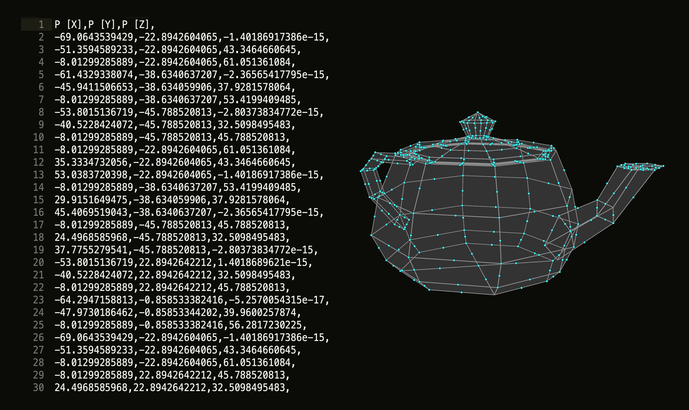
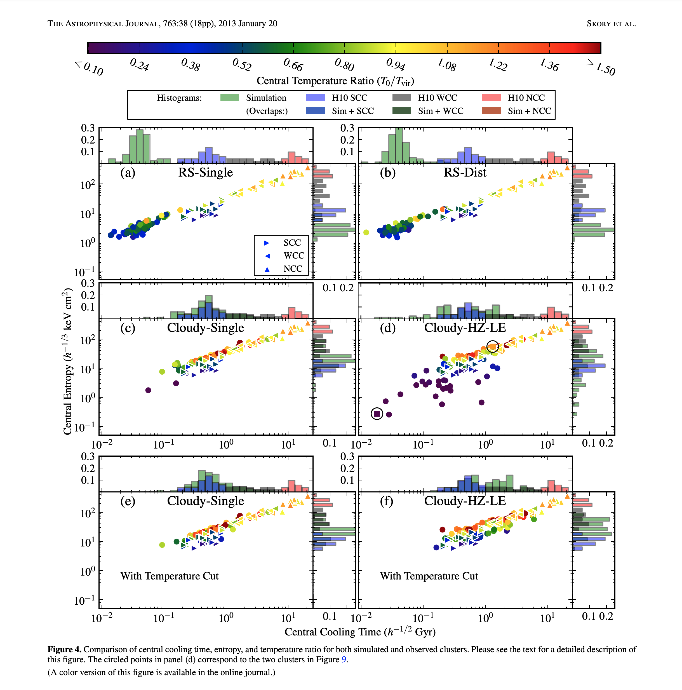

<!-- .slide: class="titleslide" -->

# Data Visualization
<div style="height: 6.0em;"></div>
## Andrew Christensen
## Spring 2019
## Lecture 4

---

## Warm-Up Activity

1. What is the visualization trying to show?
1. What are its methods?
1. What are the strengths / weaknesses?

https://www.nytimes.com/interactive/2018/09/19/upshot/facebook-county-friendships.html

notes:
a major takeaway is that people tend to be more connected across smaller distances.

You can type in a specific county like Champaign or Manhattan. Look at Champaign's connections to the state of Mississippi. Is anyone familiar with the Great Migration?

---

## Today's Topics

 * Data Types in a Visualization
 * Distributions

---

## Data Types

When we are examining data, what can we look for?

 * Does this data describe a **geometric** object?
 * Are the data points **connected** to each other?
 * Can we describe data points with a fixed set of **categories**?
 * Is there a **quantity** associated with the data?
 * Are the datapoints **continuous** along one or more dimensions?

---

## Example: Geometric Object

| v1 | v2 | color |
|:-|:-|-:-|
|8.5|-9| r |
|10|-8| r |
|11.5|-7| r |
|12.5|-5.5| r |
|13|-4| r |
| ... | ... | ... |
|-2.5|-6|b|
|-1.5|-7|b|
| ... | ... | ... | 
<!-- .element class="left" -->

<!-- .slide: data-background-image="images/mushroom.svg" data-background-size="30% auto" data-background-position="right 20% bottom 50%" -->

---

## Example: Geometric Object



---

## Examples: Quantity

We can encode the values associated with a data point by modifying how we
express it.  To do so, we need to be able to identify the different components
of representation, and how we can scale between them.

---

## Dimensions of Representation

Given a single datum on a visualization, we can control several different
components of its representation.

 * Position

<!-- .slide: data-background-image="images/dimensions_1.svg" data-background-size="auto 50%" data-background-position="right 20% bottom 50%"-->

---

## Dimensions of Representation

Given a single datum on a visualization, we can control several different
components of its representation.

 * Position
 * Color

<!-- .slide: data-background-image="images/dimensions_2.svg" data-background-size="auto 50%" data-background-position="right 20% bottom 50%"-->

---

## Dimensions of Representation

Given a single datum on a visualization, we can control several different
components of its representation.

 * Position
 * Color
 * Size

<!-- .slide: data-background-image="images/dimensions_3.svg" data-background-size="auto 50%" data-background-position="right 20% bottom 50%"-->

---

## Dimensions of Representation

Given a single datum on a visualization, we can control several different
components of its representation.

 * Position
 * Color
 * Size
 * Shape

<!-- .slide: data-background-image="images/dimensions_4.svg" data-background-size="auto 50%" data-background-position="right 20% bottom 50%"-->

---

## Dimensions of Representation

Given a single datum on a visualization, we can control several different
components of its representation.

 * Position
 * Color
 * Size
 * Shape
 * Relationship

<!-- .slide: data-background-image="images/dimensions_5.svg" data-background-size="auto 50%" data-background-position="right 20% bottom 50%"-->

---

## Dimensions of Representation

Given a single datum on a visualization, we can control several different
components of its representation.

 * Position
 * Color
 * Size
 * Shape
 * Relationship
 * Motion

<!-- .slide: data-background-image="images/dimensions_6.gif" data-background-size="auto 50%" data-background-position="right 20% bottom 50%"-->

---

<iframe width="1024" height="576"
src="https://www.youtube.com/embed/kY-pUxKQMUE" frameborder="0"
allow="autoplay; encrypted-media" allowfullscreen></iframe>

---

[This plot](http://iopscience.iop.org/article/10.1088/0004-637X/763/1/38/meta#apj455166f4)
might be a bit too busy.



---

Someone on [Reddit](https://www.reddit.com/r/dataisugly/comments/8msftx/the_marvel_that_is_3d_stacked_scatter_pie_columns) designed a 3D Stacked Scatter Pie Column plot ... as an example of what not to do.


---

## Continuous Data

Data organized in a continuous fashion along one or more dimensions can enable
additional operations.

<!-- .slide: data-background-image="images/slice.jpg" data-background-size="auto 50%" data-background-position="right 20% bottom 50%"-->

notes:
For instance, you can take a slice image through continuous 3D data at any depth. This is what most MRI and X-ray imagery is doing. 

---

## Continuous Data

Data organized in a continuous fashion along one or more dimensions can enable
additional operations.

<!-- .slide: data-background-image="images/pointSlice.gif" data-background-size="auto 50%" data-background-position="right 20% bottom 50%"-->

notes:
on the flip side, non-continuous data doesn't give very helpful results

---

## Distributions

Given a set of points, how do we make them into a continuous distribution?

<!-- .slide: data-background-image="images/distribution_clean.jpg" data-background-size="75% auto" data-background-position="bottom 30% center"-->

notes:
When working with data, we typically have a limited number of sampled points to work with - but those points are meant to demonstrate a trend.

In this made-up graph of rainfall events collected over the course of a year, there are no records of rain for the month of September. Is this dataset evidence that it never rains in September?

---

## Distributions

<!-- .slide: data-background-image="images/distribution_oversampled.jpg" data-background-size="75% auto" data-background-position="bottom 30% center"-->

notes:
According to this curve, that's exactly what it means. If we treat every data point as an isolated incident, the continuous distribution tells us that every year we should expect 1 inch of rain on February 10th, and no rain for the rest of the month.

This is obviously a poor representation of chances of rain over the course of the year.

---

## Distributions

<!-- .slide: data-background-image="images/distribution_undersampled.jpg" data-background-size="75% auto" data-background-position="bottom 30% center"-->

notes:
Perhaps this is better? Now we're considering every datapoint at every point in our continuous distribution. This certainly shows a rise in the spring when it's wetter.

But it also suggests that we might expect a large amount of rain in the winter when the temperature is below freezing. This distribution curve is probably far too general.

---

## Distributions

Given a set of points, how do we make them into a continuous distribution?

<!-- .slide: data-background-image="images/binning_1.svg" data-background-size="75% auto" data-background-position="bottom 30% center"-->

---

## Distributions

Given a set of points, how do we make them into a "continuous" distribution?

<!-- .slide: data-background-image="images/binning_2.svg" data-background-size="75% auto" data-background-position="bottom 30% center" -->

notes:
if we use the binning technique we used for histograms, we can collect data into buckets and start to isolate groups of datapoints.

---

## Distributions

<!-- .slide: data-background-image="images/distribution_histogram.jpg" data-background-size="75% auto" data-background-position="bottom 30% center"-->

notes:
So here we're binning the rain data by month. 

Note that the sizes of the bars are not based on how many records there are per month, but what value the records from each month have.

---

## Distributions

<!-- .slide: data-background-image="images/distribution_histogram_curve.jpg" data-background-size="75% auto" data-background-position="bottom 30% center"-->

notes:
And once we have these bars, we can use them to draw a much more meaningful trendline. 

---

## Distributions

<!-- .slide: data-background-image="images/distribution_curve.jpg" data-background-size="75% auto" data-background-position="bottom 30% center"-->

notes:
And this curve might be a useful continuous distribution for the data.

You can imagine that if my bins were not grouped by month, but by week, or by 3-month season, you might see some different frequencies in this distribution curve.

---

## Distributions

<!-- .slide: data-background-image="images/distribution_histogram.jpg" data-background-size="75% auto" data-background-position="bottom 30% center"-->

notes:
But let's go back for a moment. Can anyone tell me a weakness of this histogram? Particularly with respect to September?

We're still representing September as if it never rains. And all we actually know about September is we have no records for that month. It's possible that if we had a record for September, it could show that September is one of the months of heaviest rain.

This is the reason that uniformly binning by week or by month or whatever unit could be a problem. If a bin has no data,
it's going to create a misleading dip in the distribution. But if you keep increasing your bin size, you disperse all the
 interesting trends in the data.

---

## Distributions

<!-- .slide: data-background-image="images/distribution_histogram_thresh1.jpg" data-background-size="75% auto" data-background-position="bottom 30% center"-->

notes:
Non-uniform binning is an option to help represent the data more accurately.

This histogram is built by combining adjacent bins until every bin has at least one data point.

---

## Distributions

<!-- .slide: data-background-image="images/distribution_histogram_curve_thresh1.jpg" data-background-size="75% auto" data-background-position="bottom 30% center"-->

notes:

---

## Distributions

<!-- .slide: data-background-image="images/distribution_curve_thresh1.jpg" data-background-size="75% auto" data-background-position="bottom 30% center"-->

notes:
You can see that the curve derived from this binning scheme no longer has a dip in the month of September.

---

## Distributions

<!-- .slide: data-background-image="images/distribution_histogram_thresh2.jpg" data-background-size="75% auto" data-background-position="bottom 30% center"-->

notes:
Usually a single datapoint isn't considered sufficient to illustrate a trend. This histogram shows a binning scheme that requires at least two datapoints. Typically you'll want many more than 2.

---

## Distributions

<!-- .slide: data-background-image="images/distribution_histogram_curve_thresh2.jpg" data-background-size="75% auto" data-background-position="bottom 30% center"-->

notes:
This new curve helps to reduce the artificial drop in the distribution that happened in the fall months from the previous distributions.

---

## Distributions

<!-- .slide: data-background-image="images/distribution_curve_thresh2.jpg" data-background-size="75% auto" data-background-position="bottom 30% center"-->

notes:
Of course it also blurs out the downward trend of rainfall in the winter, especially in January which starts very high. What are some things we could do to make sure our distribution better represents the winter months?

some ideas: </br>
bin cyclically, wrapping from December to January</br>
be sure to include datapoints in the winter even if they have values of zero</br>

---

## Distributions

Calculating distributions on large datasets come with a processing cost.

Uniform-width bins allow us to compute:

```python
bin_id = floor( (value - left_edge ) / bin_width)
```

<!-- .slide: data-background-image="images/binning_2.svg" data-background-size="75% auto" data-background-position="bottom 30% center" -->

---

## Distributions

Calculating distributions on large datasets come with a processing cost.

Non-uniform bins require searching.

<!-- .slide: data-background-image="images/binning_3.svg" data-background-size="75% auto" data-background-position="bottom 30% center" -->

notes:
The search time can be more efficient if there's some kind of simple formula determining the variation in bin size - for instance if every bin size is a multiple of 10, you'll never have to look for a bin starting at 1 or 2 or 3, etc.

---

## Summation

Useful for describing total quantity measured.

 * Inches of rain.
 * Total time of recorded UFO sitings in the area.
 * How many votes were cast?

---

## Arithmetic Average

Useful for describing average or mean quantity.

* Average rainfall in the area.
* Average time of UFO sighting.
* Who was the average candidate?

---

## Weighted Average

Useful for describing mean, but not strict arithmetic mean.

* Average rainfall, weighted by how humid it was that day.
* What was the most commonly seen UFO type, as a function of the time it was
  seen?
* What's the mean age of a voter, as a function of the total years of
  experience in the election?

---

## Scales and Scaling

Displaying a quantity requires assigning to it a given representation.
A common mechanism for doing this is to vary the color of a particular region
or set of display units with respect to the quantity expressed in those units.

In mathematical notation, we first "normalize" our data value by assigning to a
range:

$g(v) \rightarrow v' \in [0, 1]$

and then, given a color mapping function, assign to this a given color:

$f(v') \rightarrow (R, G, B)$

---

## Scales and Scaling

Group discussion:

  * How is this similar to or different from our discussions of "binning" and
    histogramming?
  * What are some functions we can use for $g(v)$?
  * What are some considerations we need to take into account for variable
    bins?

---

## Histograms and Binning

Group work:

Write a function -- in plain language at first, and then in python -- that
takes a set of values, a series of bin "edges," and returns to you the integer
IDs of the bins that each belongs to.

---

## Assignment 2

Using one of the tools that we have discussed (matplotlib or vega-lite),
construct a visualization of the Illinois Building Inventory that communicates
the following information:

 * Relationship between the year acquired and the year constructed
 * Total square footage as a function of congressional district
 * Average square footage per floor as a function of congressional district
 * Square footage for the five most common departments as a function of year

Each component will be worth 5 points and *must* be a completely communicative
visualization -- including labels and a one paragraph writeup of successes and
shortcomings in your approach.  Submit a notebook or a set of JSON gists to
Moodle.  All source code must be in these files.
