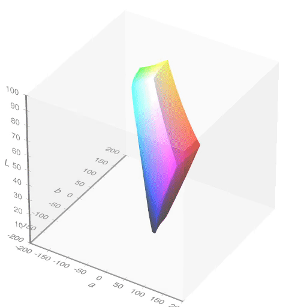
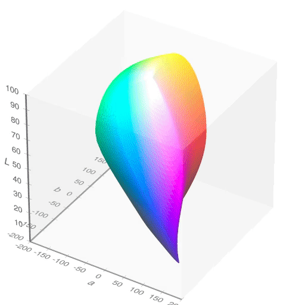
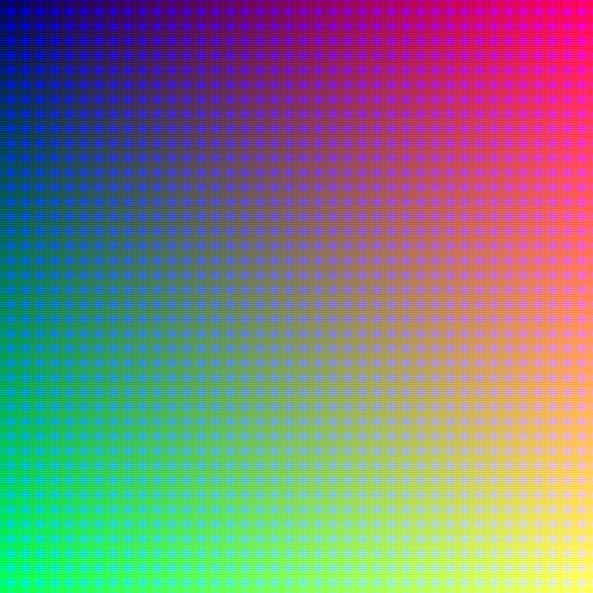
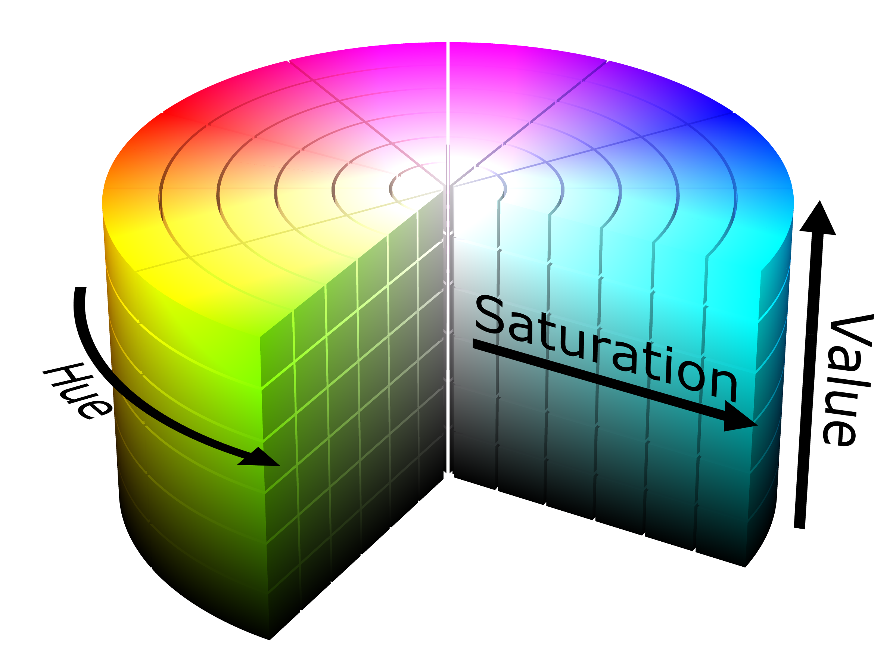
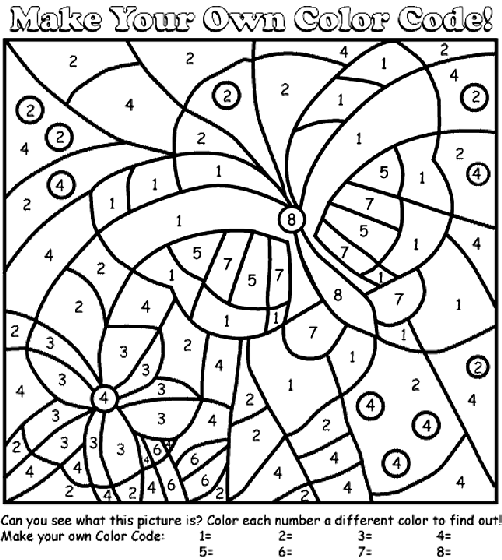

<!-- .slide: class="titleslide" -->

# Data Visualization
<div style="height: 6.0em;"></div>
## AJ Christensen
## Spring 2019
## Lecture 5

---

## Warm-Up Activity

1. What is the visualization trying to show?
1. What are its methods?
1. What are the strengths / weaknesses?

http://old.vijayp.ca/blog/2012/06/colours-in-movie-posters-since-1914/

[Movie Poster Hue](images/fullSaturation.png)

[Movie Poster Value](images/modifiedBrightness.png)

---

## Today's Topics

 * Transformations
 * Colors
 * Color mapping
 * Data Characteristics
 * Choosing Visualizations

---

## Transformations

Affine transformations satisfy:

$ \vec{y} = A\vec{x} + \vec{b} $

<!-- .slide: data-background-image="images/affine_1.svg" data-background-size="30% auto" data-background-position="right 20% bottom 50%" -->

notes:
"affine" transformations maintain parallel lines. As compared to projection, euclidian, or similar transformations.

---

## Transformations

Affine transformations satisfy:

$ \vec{y} = A\vec{x} + \vec{b} $

We can use these to accomplish:

 * Shifts

<!-- .slide: data-background-image="images/affine_2.svg" data-background-size="30% auto" data-background-position="right 20% bottom 50%" -->

---

## Transformations

Affine transformations satisfy:

$ \vec{y} = A\vec{x} + \vec{b} $

We can use these to accomplish:

 * Shifts
 * Rotations

<!-- .slide: data-background-image="images/affine_3.svg" data-background-size="30% auto" data-background-position="right 20% bottom 50%" -->

---

## Transformations

Affine transformations satisfy:

$ \vec{y} = A\vec{x} + \vec{b} $

We can use these to accomplish:

 * Shifts
 * Rotations
 * Scaling

<!-- .slide: data-background-image="images/affine_4.svg" data-background-size="30% auto" data-background-position="right 20% bottom 50%" -->

---

## Choosing a Visualization

When we are examining data, what can we look for?

 * Does this data describe a **geometric** object?
 * Are the data points **connected** to each other?
 * Can we describe data points with a fixed set of **categories**?
 * Is there a **quantity** associated with the data?
 * Are the datapoints **continuous** along one or more dimensions?

---

## Categories and Continuity

Today we'll talk about representing things based on categories and continue discussing continuities.

---

## How Do Colors Work?

Rods (low-light) and cones (color) mediate vision. Humans have about 20 times
as many rods (120 million) as cones (6 million).

 

---

## How Do Colors Work?

Rods (low-light) and cones (color) mediate vision. Humans have about 20 times
as many rods (120 million) as cones (6 million).

 

---

## Let's Try It

http://enchroma.com/test/instructions/

---

## Color Matching Function

<!-- .slide: data-background-image="images/cmf.png" data-background-size="auto 75%" -->

---

## "Naming" Colors

 * RGB triplets, sometimes compressed into hexadecimel ("#00FFAA", etc)

notes: 
Hexadecimal only shows 16 million colors, RGB as uncompressed floats can theoretically represent quite a bit more (but there's a limitation of what monitors can display)

R = 2^8
G = 2^8
B = 2^8

RGB = 2^24 = 16 million

hexadecimal = 16^6 = 16 million

---

## "Naming" Colors


notes:
the mandrill image was an early color standardization image established by the Dept of Defense

---

## "Naming" Colors

 * RGB triplets, sometimes compressed into hexadecimel ("#00FFAA", etc)
 * Color spaces 
   * HSV (Hue, saturation, value)
   * [CIELAB](https://en.wikipedia.org/wiki/CIELAB_color_space)
   * sRGB, Adobe sRGB

notes: 
HSV is typically a color space used by color designers.

sRGB "standard RGB" is a color space that was standardized to unify different monitors and printers. 

CIELAB is the color space that covers the average of human vision.

---

## "Naming" Colors


notes:
This video scans through different hues, which are the part of the rainbow you want

Then different saturations, which is how vibrant or gray the colors are

Then different values, which is how bright or dark the colors are.

---

## "Naming" Colors

<table><tr>
<td></br>sRGB</td>
<td></br>CIELAB</td>
</tr></table>

notes:
this unified space of colors that works on most displays and printers is NOT the full range of human perception.

---

## "Naming" Colors

 * RGB triplets, sometimes compressed into hexadecimel ("#00FFAA", etc)
 * Color spaces 
   * HSV (Hue, saturation, value)
   * [CIELAB](https://en.wikipedia.org/wiki/CIELAB_color_space)
   * sRGB, Adobe sRGB
 * List of colors by name
   * [Web](https://www.w3schools.com/colors/colors_names.asp)
   * [matplotlib](https://matplotlib.org/2.0.2/examples/color/named_colors.html)

notes: 
coding environments will often provide "named" colors if you're more interested in simplicity than flexible design

---

## "Naming" Colors

<table><tr>
<td></br>HTML</td>
<td></br>matplotlib</td>
</tr></table>

---

## Color Palettes

 * Resources:
  * [colorbrewer](http://colorbrewer2.org)
  * [palettable](www.palettable.io) (package)

notes:
there are a million websites that allow you to create color palettes

---

## Sequential Colormaps


notes:
these are also known as monochromatic

the hue doesn't change, but the value and the saturation do

---

## Diverging Colormaps


notes:
this shows you that different colors in the rainbow have different perceived brightness.

The outsides of this color map get darker while the center is brighter.

---

## Qualitative Colormaps


notes:
The blended areas of the continuous map here are kind of gross looking. This kind of random color map is best for categorical data that is NOT continuous.

---

## It's full of colors

https://commons.wikimedia.org/wiki/File:16777216colors.png



notes:
This grid is one way to show all the 16 million colors. They kind of get blurred out when looking at the image in this size, but if you zoom in at the link provided, you can see every pixel from red to green to blue, and from black to white.

---

## HSV Wheel

https://commons.wikimedia.org/wiki/File:HSV_color_solid_cylinder.png



notes:
you can see that saturation and value are linear axes while hue is cyclical.

---

## Magenta


notes:
just a point of interest, what wavelength would you say magenta (or purple) is?

---

## Palette Mapping


Assign each value to a specific color or element.

---

## Palette Mapping



---

## Palette Mapping


---

## Color Mapping

$f(v) \rightarrow (R, G, B)$

We can also re-map:

$f(v') \rightarrow (R, G, B)$

$v' = f(v)$

For instance, with logs or squares.

---

## Color Mapping: Linear Mapping

We map from a range of values to (0, 1):

$ v' = (v - v_0)/(v_1 - v_0) $

---

## RGB Components

<!-- .slide: data-background-image="images/gist_stern_colors.png" data-background-size="auto 75%" -->

---

## RGB Components

<!-- .slide: data-background-image="images/gray_colors.png" data-background-size="auto 75%" -->

---

## RGB Components

<!-- .slide: data-background-image="images/jet_colors.png" data-background-size="auto 75%" -->

---

## RGB Components

<!-- .slide: data-background-image="images/magma_colors.png" data-background-size="auto 75%" -->

---

## Colormaps: Loading Data

Today we will explore images and colors, and how our choice of colormaps
affects our perception of them.

You will need to load data into your notebook, which you can do using these
commands:

```
import numpy as np
import h5py

fn1 = "/home/shared/sp18-is590dv/data/michigan_lld/michigan_lld.flt"
michigan = np.fromfile(fn1, dtype='f4').reshape((5365, 4201))

fn2 = "/home/shared/sp18-is590dv/data/single_dicom.h5"
with h5py.File(fn2) as f:
    scan = f["/scan"][:]
```

---

## Colormaps: Prep Work

We will now utilize the `plt.imshow` command to show these images, and discuss
how to modify the transformation of the data beforehand.

---

## Colormaps

Group Activity - with the Michigan data and the scan data, evaluate:

 * How to choose a colormap
 * What are some good "bounds" for that colormap
 * How do we set our transform?
