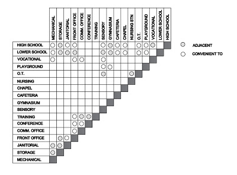

<!-- .slide: class="titleslide" -->

# Data Visualization

## AJ Christensen
## Spring 2019
## Lecture 9

---

## Warm-Up Activity

 1. What is the visualization trying to show?
 1. What are its methods?
 1. What are the strengths / weaknesses?

[XKCD Money](https://xkcd.com/980/huge)

---

## Networked and Hierarchical Data

 1. Node-link diagrams
 1. Matrix views

notes:
There are two primary types of visualization for data that has inherent linkages.

---

## Node-link Diagrams

 1. Trees
 1. Force-Directed Graphs

notes:
These are the primary ways that you would draw a linked node diagram.

---

## Node-link Diagrams

 1. Nodes
   * might have 0-to-many edges linked to them
 1. Edges
   * associated specifically with 2 nodes
   * can have a direction
   * can have a weight

---

## Tree Diagrams

 * Topological
 * Ordered
   * Left-to-Right
   * Inside-Out
 * Always one incoming edge (low density)
 * Discrete, not Continuous

notes:
trees have a topology or hierarchy. These are especially good for a *deep* hierarchy.

The physical space between nodes isn't meaningful like it would be in a scatter plot. Rather the number of "hops" along edges is important.

---

## Force-Directed Graphs

 * Path Distance
 * Joint or Disjoint
 * Discrete, not Continuous

notes:
These are useful for identifying clusters, finding all possible paths, finding the shortest path, finding all adjacent nodes, finding bridges between unconnected nodes, etc.

They use force to push apart what would other be a mad hairball.

---

## Force-Directed Graphs

 * Springs
 * Weighted Edges (spring force)
 * Weighted Nodes (repel force)

notes:
You could place the points in any arbitrary place and let them evolve. You could start with a scatter plot representing numerical values, but the nodes will just move. You could also put all the points at the same starting place.

---

## Force-Directed Graphs

 * Non-deterministic (different every time)
 * Link Density can be an issue when over 3-4 links per node

---

## Matrix Views

 1. Adjacency Matrix
   * List all values along X AND Y axes

notes:
Matrix views remove occlusion and hairball issues completely. They are preferred for extremely dense data.

However they do not show topology, and they might be less intuitive to identify clustering.

---

## Matrix Views

 1. Adjacency Matrix
   * List all values along X AND Y axes
   * Can cut in half along diagonal if non-directional

notes:
This is sometimes called a "Folded" adjacency matrix

---

## Matrix Views

 1. Adjacency Matrix
   * List all values along X AND Y axes
   * Can cut in half along diagonal if non-directional
   * Color cells by edge weight

notes:
Matrix views remove occlusion and hairball issues completely. They are preferred for extremely dense data.

However they do not show topology, and they might be less intuitive to identify clustering.

---

## Matrix Views

notes:
Pokemon type-effectiveness chart yay!

Notice this is directional - Attackers and Defenders don't have same effect on different types.

---

## Hierarchical Data

 1. Trees
 1. Containment
   1. Treemaps
   1. Nested Circles

notes:
containment better at shallow, broad trees than node-link diagrams

good for identifying topological outliers

---

## Compound Networks

 1. Network and Tree together

notes:
dinosaur fossil example? hierarchy:  network: friendships

---

## Today - and assignment

We will be ending early for the noontime presentation at CIRSS.

You will have an assignment for this presentation, to be turned in by class
next week.  Your assignment is to follow along with this talk, take notes, and
supply a writeup about its usage of visualization:

 * How was visualization used in the talk?
 * How was visualization used in the discovery?
 * What were the types of visualization used? What comments did you have about
   them?

This writeup should utilize the vocabulary we use in class, and the
classification of the types of visualization.  It should be at a minimum 2
pages and include a description of the discovery presented, its context, and a
reasonable discussion of how visualization was used in the process.

---

## ipyleaflet

Leaflet is another mechanism of plotting, displaying and interacting with maps.
We will introduce ipyleaflet this morning.

---

## Today's Lab

Today: we will be building a dashboard.

The dataset is on data.world and is entitled:

"Surgery Charges Across the U.S."

We will take time to explore this dataset on our own, then discuss what we can
explore.
