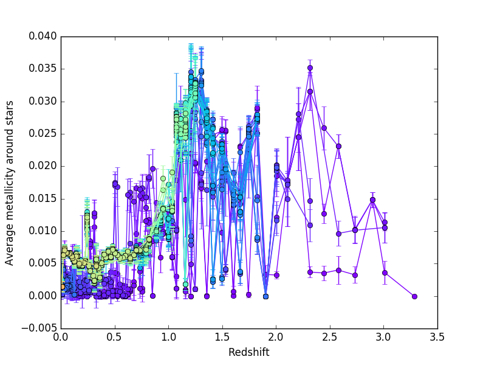
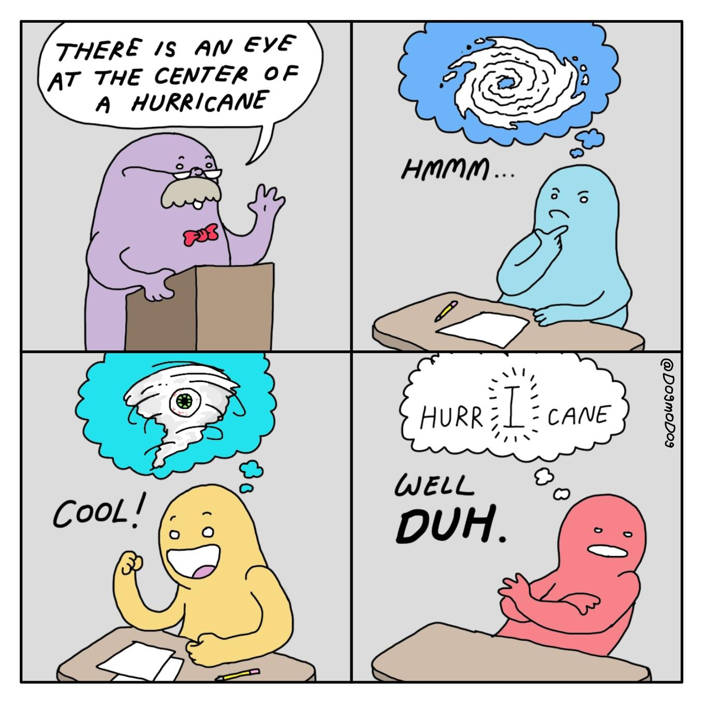
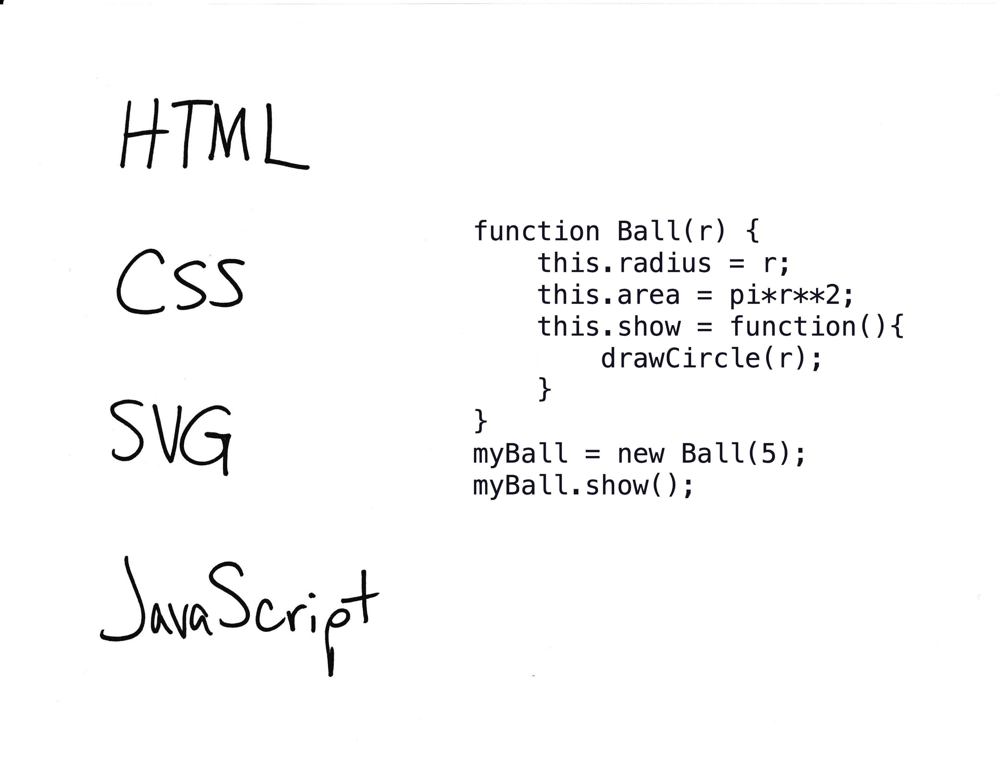

<!-- .slide: class="titleslide" -->

# Data Visualization

## Jill P. Naiman
## Spring 2019 (Online)
## Lecture 10

---

## Today

 * Communication with an Audience (Viz for self, peers, others)
 * Final project
 * Publishing
   * D3.js
   * Idyll
   * Github Pages (next week)

---

## Three Classes of Visualizations

1. Viz for Self
1. Viz for Experts
1. Viz for the Public

---

## Viz for Self

There are no rules!

notes:
Labels don't matter. Colors don't have to look nice. Interactivity doesn't have to be fast. Here we are just trying to get something on screen that represents the data. Often this is challenge enough.

As the designer, you know what choices you have made, so "elegant design" isn't a huge deal - although don't go too crazy or you could make things more confusing for yourself.

---

## Viz for Self

notes:
This is an example from AJ (the in-person instructor). He uses 3D software like Houdini in his "everyday" life and so this is his software of choice.  Here, he used 3D software to make a 2D plot, and arranged points to look like a bar chart even though they were rendered as individual points - aka a scatter plot.

It just had to work, and we used the most convenient software.

---

## Viz for Self

notes:
Here are some examples from my work

There are plots of data from a large scale simulation of the universe.  Here, I'm curious about how the average number of elements heavier than helium in our simulation changes over time.

---

## Viz for Self

name of: L25n512TNG_shenplot_STARS_ylimn0p5_bins_largeEu_1e2_nx050_ny050_sn099.png

notes:
You can even tell from the name of the file (which runs off the page here) that I'm playing with a bunch of things.  For example I'm plotting here stars, but there is no way you'd really get that from the actual plot itself.

These are plots that show an example of how one might "explore" the data - look for relationships.

---

## Viz for Self

Later this became (viz for peers)

[Paper if you're really curious](https://arxiv.org/pdf/1707.03401.pdf)

notes:
later, that plot became this plot right here which can be thought of as viz-for peers

While its probably not something that you all understand (unless there are some astronomers in our midst) - you can see I'm more careful here about fonts, presentatin, color schemes and actually labeling things

---

## Viz for Self

Let's talk about exploration.

 * What are characteristics of data that would influence how you visualize it?
 * What information do you have that would be visually interesting?
 * What information do you not have that you need to understand the importance of the data?

Example: A banking database where each record is a bank transaction and the fields include date, deposit or withdrawal amount, customer id, and the interest rate of the account.

---

## Viz for Self

Let's talk about exploration.

 * What are characteristics of data that would influence how you visualize it?
 * What information do you have that would be visually interesting?
 * What information do you not have that you need to understand the importance of the data?

Example: A spreadsheet of experimental crop growth measurements where each record is a measurement, and the fields include date, plant species, plant id number, number of leaves, plant height, number of internodes, and average leaf length.

notes:
internodes = the number of "generations" of a plant, aka how many branches come off the main stem. 

---

## Viz for Self

Let's talk about exploration.

 * What are characteristics of data that would influence how you visualize it?
 * What information do you have that would be visually interesting?
 * What information do you not have that you need to understand the importance of the data?

Example: A computational simulation of a galaxy where each record is a timestep in the evolution of the 3D grid, and the fields include time, X position, Y position, Z position, gas density, gas temperature, gas metallicity, and number of stars.

---

## Viz for Self

What do you want to get out of visualization for yourself?

 * Do you want to find meaning?
 * Do you want to understand how to guide further visualizations?
 * Is the story you want to tell already known to you?
 * What __shortcuts__ can you take?

notes:
shortcut ideas ... subsampling, delete unused fields, use a simpler tool, manually select outliers by hand instead of doing it procedurally

forget labels that others have to figure out

don't worry about color schemee

---

## Viz for Experts

To design a visualization for experts, you need to analyze how they process information.

 * What do they know?
 * What conventions will they assume?
 * Are they able to fill in the blanks of information?

---

## Viz for Experts

notes:
Here's a series of visualizations made by or for domain experts that AJ just had lying around on his laptop.

What are some things you notice they have in common?

---

## Viz for Experts

notes:
Here's a series of visualizations made by or for domain experts that I just had lying around on my laptop.

What are some things you notice they have in common?

---

## Viz for Experts

notes:
Here's a series of visualizations made by or for domain experts that I just had lying around on my laptop.

What are some things you notice they have in common?

---

## Viz for Experts

notes:
Here's a series of visualizations made by or for domain experts that I just had lying around on my laptop.

What are some things you notice they have in common?

---

## Viz for Experts

notes:
Here's a series of visualizations made by or for domain experts that I just had lying around on my laptop.

What are some things you notice they have in common?

---

## Viz for Experts

Experts often want to interrogate the data themselves.

How can they do that?
 * Linked Dashboards
 * Side-by-side comparison plots
 * Text annotation with specific values listed
 * Color bar annotation

notes:
ask students - other ideas? what about interactivity? (Interactivity needs to be decent)

---

## Viz for Experts

Experts are looking to isolate variables to make scientific conclusions.

How can we make visualizations more analytical?
 * Reduce the dimensionality of the image (slices)
 * Viewpoint from "outside the box"
 * Extremely high contrast color choices (or highlight different features)

notes:
ask students - other ideas? What about animated data?

---

## Viz for the Public

This is what you're most accustomed to, because usually YOU are the public.

notes:
Who here is an expert on the historical accuracy of movies? Do you think this visualization was created for those experts? Or was it created for you? How can you tell?

---

## Jargon

<iframe src="https://player.vimeo.com/video/206139648" width="640" height="360" frameborder="0" webkitallowfullscreen mozallowfullscreen allowfullscreen></iframe>

<a href="https://vimeo.com/206139648">Jaret before and after</a> from <a href="https://vimeo.com/aldacenter">Alan Alda Center</a> on <a href="https://vimeo.com">Vimeo</a>.

notes:
so here is an example of a scientist and, in a typical scientist fashion, using a  lot of jargon

but then after taking some improv he's able to communicate more effectively to the public

---

## Jargon

Definition: Special words or expressions that are used by a particular profession or group and are difficult for others to understand.

notes:
When working with experts on their data, they will often try to use words that are specific to their field. As a data communicator, it's your job to decipher that jargon and make it more approachable to the public.

---

## Jargon

[xkcd.com/1133](https://xkcd.com/1133/)

notes:
This XKCD webcomic makes fun of how much jargon scientists use. He tries to explain NASA's Saturn V rocket using only the 1000 most common words in the English language. 

He actually wrote a whole book about science this way called "Thing Explainer."

---

## Jargon

[Simple Writer](https://xkcd.com/simplewriter/)

notes:
And here's a neat tool he created to help you write your own!

Before:
"The Advanced Visualization Lab creates cinematic treatments of supercomputer data for immersive displays."

After:
"The very good picture making team creates movies of huge computer information for screens you can be inside of."

---

## Storytelling

Let's just get it out there: humans don't respond to data. They respond to stories.

Which of these do you care about more?
 * Global average atmospheric carbon dioxide is 405 ppm.
 * Polar bears are dying because the ice they use to hunt is melting.

notes:
In visualization, we really want to tell a story, not just a list of facts.

---

## Storytelling

Why is that?

notes:
Emotional response to storytelling is an evolutionary trait humans developed to form stronger social bonds and learn from each other's experience.

---

## Storytelling

Freytag's Pyramid

notes:
A story needs setup, conflict, and resolution. One thing many novice storytellers forget is to have a resolution or ending. You need to wrap it up in a neat package!

aside - "denouement" is one of my favorite words

---

## Storytelling

Characters and Conflict
 * People as subjects: Two political candidates are battling for office
 * People as researchers: Dr. Smith is trying to cure cancer
 * Objects as characters: The photons are trying to push their way to the sun's surface

notes:
each story is going to have different sorts of characters and different kinds of conflicts

here are a few examples - you can even make scientific data into a story!  Don't you really want to root for the photons to make it out of the sun?

---

## Know your Audience

<iframe width="853" height="480" src="https://www.youtube.com/embed/opqIa5Jiwuw" frameborder="0" allow="accelerometer; autoplay; encrypted-media; gyroscope; picture-in-picture" allowfullscreen></iframe>

notes:
so, we won't watch this whole thing, but it is worth checking out how the jargon/language changes when he's talking to different groups of folks

---

## Know your Audience

What do you know about them?
 * Age
 * Nationality
 * Occupation
 * Affiliation with a Special Interest / Organization
 * Or is it literally EVERYBODY (web publishing)

notes:
You can hone your narrative for certain audiences. If it's the broadest audience, like for journalism shared online, you need to keep in mind that there will be children, grandparents, experts, politicians, people with money, etc all in the audience.

---

## Visualization for the Public

Images can be more powerful than words, text, and numbers. Images can tell stories.

notes:
What can you say about this event given the picture? How is this different from an average day on the National Mall in DC?

What is the story of this photograph?

---

## Visualization for the Public

Context is vital for the public.
 * Embed multiple datasets
 * Place something familiar to relate to the unfamiliar
 * Smooth transitions so you can see where you've come from and where you're going to

notes:
This is different from a visualization for Experts where you usually want to isolate the dataset.

With experts, you can asssume some background of understanding.  You might start a presentation or paper with a background summary, but based on the field you don't have to explain as much.  For example, if I'm giving a astronomy talk, I can assume folks know the difference between newtonian gravity and general relativistc treatments and roughly when each apply (GR for going fast, or near big things).

---

## Visualization for the Public

Context is vital for the public.

notes:
The AVL created this sequence for a movie, which originally moved much slower on a large screen, and had a narrator explaining the sequence. Someone recaptured it and made it into a gif, sharing it on reddit with the caption "A simulation of the Earth's moon being formed."

What context might have been lost?

How well does the imagery speak for itself?

---

## Visualization for the Public

Identifying the narrative
 * Do you first find data, or first find a story?
 * What is the difference between the data narrative and a narrative for the public?

notes:
In visualization for the public, typically we will start with a dataset, and then build a narrative around it, and seek out more data to build context.

Data narrative = what the data collector is researching

Public narrative = what makes an interesting story and provides context

This is different than viz for experts where you are typically talking about the dataset you have been working with specifically.

---

## Visualization for the Public

 1. Aesthetics Matter
 1. Interactivity should not have any lag or latency
 1. Relative values are often more important than specific values
 1. Limit the amount of text/reading
 1. Limit the amount of information being packed in

---

## Visualization for the Public

 * [Election Forecast - fivethirtyeight](https://projects.fivethirtyeight.com/2018-midterm-election-forecast/senate/)
 * [Online Dating - okCupid](https://theblog.okcupid.com/exactly-what-to-say-in-a-first-message-2bf680806c72)
 * [DiCaprio Love Life - reddit](https://www.reddit.com/r/dataisbeautiful/comments/azjti7/leonardo_dicaprio_refuses_to_date_a_woman_over_25/)

notes:
What are the narratives of these visualizations? How are they different than just a list of facts?

---

## Idyll

A web-based toolkit for storytelling with data visualizations!

 * Reduce manual coding for interactive articles
 * Integration with D3.js

---

## [D3.js](https://github.com/d3/d3/wiki/Gallery)

A JavaScript library for web-based data visualization

 * Declarative, not imperative (this is better for web coding)
 * Dynamic and interactive
 * Smooth transitions

---

## D3.js

notes:
D3 is meant to be well-integrated into the existing infrastructure of the internet. The worldwide web is a real patchwork of different languages with different syntaxes meant to do different things. Don't let it overwhelm you. They tend to be pretty simple to start, and only get more complicated when you need them to.

---

## D3.js

notes:
HTML or Hypertext Markup Language is the default syntax for websites. It's meant to be structured with tags like "head", "body", "paragraph", and "division". 

It's essentially a skeleton for other functionality to hang off of.

You may see the term DOM or Document Object Model. This is just another name for this skeleton/framework.

---

## D3.js

notes:
CSS or cascading style sheets are how you define how websites are formatted. They do color, indentation, drop shadows, etc. Each CSS call is attached to an HTML tag.

CSS can be called in-line, or from an external file dedicated exclusively to CSS code.

---

## D3.js

notes:
SVG or Scalable Vector Graphics is an XML-based implementation of vector shape drawing that's natively understood by website compilers. It's an easy way to include dynamically rendered, animated, or interactive imagery in a webpage.

---

## D3.js

notes:
JavaScript is a dynamic programming language that runs natively on webpages. If you want to run programming logic in a webpage, you use javascript. If you see interactivity or animated effects on a website, you can generally expect they were written in javascript. 

---

## Idyll

Most of this is hidden from you when writing in Idyll! But it helps to understand the underlying mechanisms.

D3.js and Idyll are another set of tools that can be used for the Final Project to share interactive visualizations connected in a narrative.

notes:
what are the limits to data size in Idyll and the web browser?

---

## Final Project

Your final project is due on April 25th.  

That is about a month.

You will have three components:

1. Viz for Self (Due April 4)
1. Viz for Peers (Due April 11)
1. Viz for Others (Due April 18)

---

## Final Project: Part 1

Due by class next week (April 4th). Submit in a Jupyter notebook.

 * Identify a dataset to explore.
   * This will be iterative!  You probably won't get one you like on the first
     try.
   * Check out sources like [data.world](https://data.world/),
     [data.illinois.gov](https://data.illinois.gov/),
     [data.gov](https://data.gov/),
     [developer.marvel.com](https://developer.marvel.com/),
     [IDB](https://databank.illinois.edu/), etc.
   * or the dataset doc that [lives right here](https://docs.google.com/document/d/15UJinT5XokAHXd9fQAYD8f6d3vEkR6kJMq8kswmkOhY/edit?usp=sharing)
 * Explore the dataset in a Jupyter notebook.  Make sure you include things that did and did not work.
 * Summarize the characteristics of the dataset in words: what does it
   represent, what are the fields/columns/rows, what data types are they, etc

---

## Final Project: Part 1 (cont)

Your datasets need to be submitted as well.  To do this, include this
information in your Jupyter notebook:

 * What is the "name" of the dataset?
 * Where did you obtain it?
 * Where can we obtain it?  (i.e., URL)
 * What is the license of the dataset?  What are we allowed to do with it?
 * How big is it in file size and in items?
 * Make a simple plot showing a relationship of interest.  You can use matplotlib or pandas (or other). Don't worry about colors, labels or anything else of that nature!

---

## Final Project: Part 1 (cont, cont)

Per usual, there will be a class google doc for this assignment.

You can share raw data sets and sources, ask questions about reading/modifying the dataset and post code to do so **that isn't working**.

Please do not share processed or cleaned datasets.

---

## Final Project: Part 2

Submit in a Jupyter notebook.  

 * Using your dataset, generate visualizations that explore the data in a
   guided way.
 * Your first component was focused on exploring the data in an unguided way.
   This component is about visualizing the data in a guided way.
 * Construct visualizations that explore each aspect you identified, with
   discussion and descriptions.
 * If you can identify improvements to the visualizations that come from
   interactivity, implement that.

---

## Final Project: Part 2 (cont)

 * The visualizations should utilize visual language relevant for "Viz for
   Peers."
    * Each and every plot should contain all relevant information: appropriate
      units, labeling, etc
    * Annotate and narrate particular pieces of interest (if there are any)
    * Use standard visual representations and augment these if necessary

---

## Final Project: Part 3

You will submit this as your final project in week 13 and get some feedback.

For week 14 (last day of class, April 25th), everbody will share their viz for a few minutes in class
(tech willing).  This doesn't have to be a formal presentation, just a quick screen-share and a few
comments about what you have been working on.

---

## Final Project: Part 3 (cont)

You may submit one or more of the following items: Idyll webpage repository, narrative Jupyter notebook.

This component will include a "for others" visualization that is deeply
narrative with appropriate interactive (or static) content and, ideally, sharable on a
website.

Some possible ways to approach this:

 * Infographic
 * Idyll
 * Jupyter notebook
 * Raw HTML

---

## Onto Idyll!

Idyll is a reactive markup language for visualization and narrative documents.

[idyll-lang.org](idyll-lang.org)

... after a quick detour into sci viz topics!