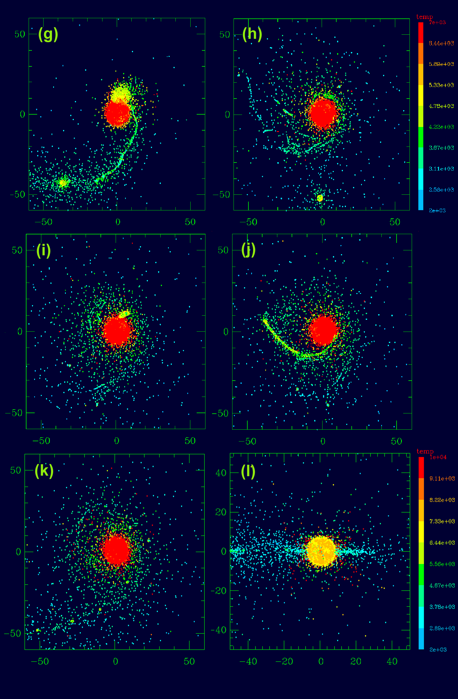
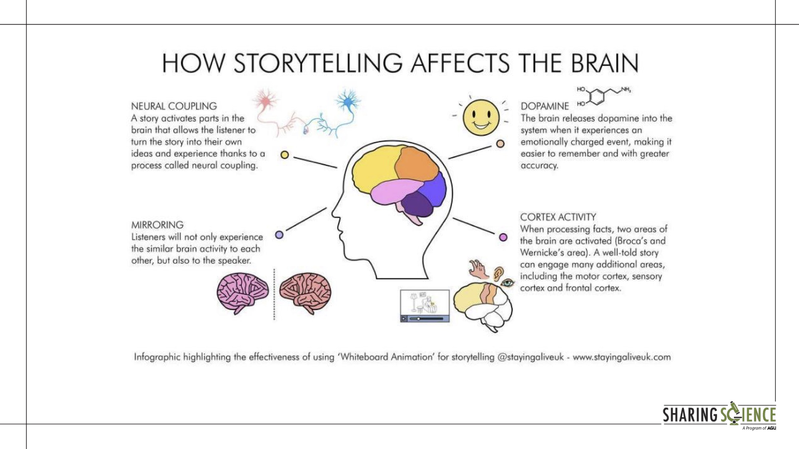
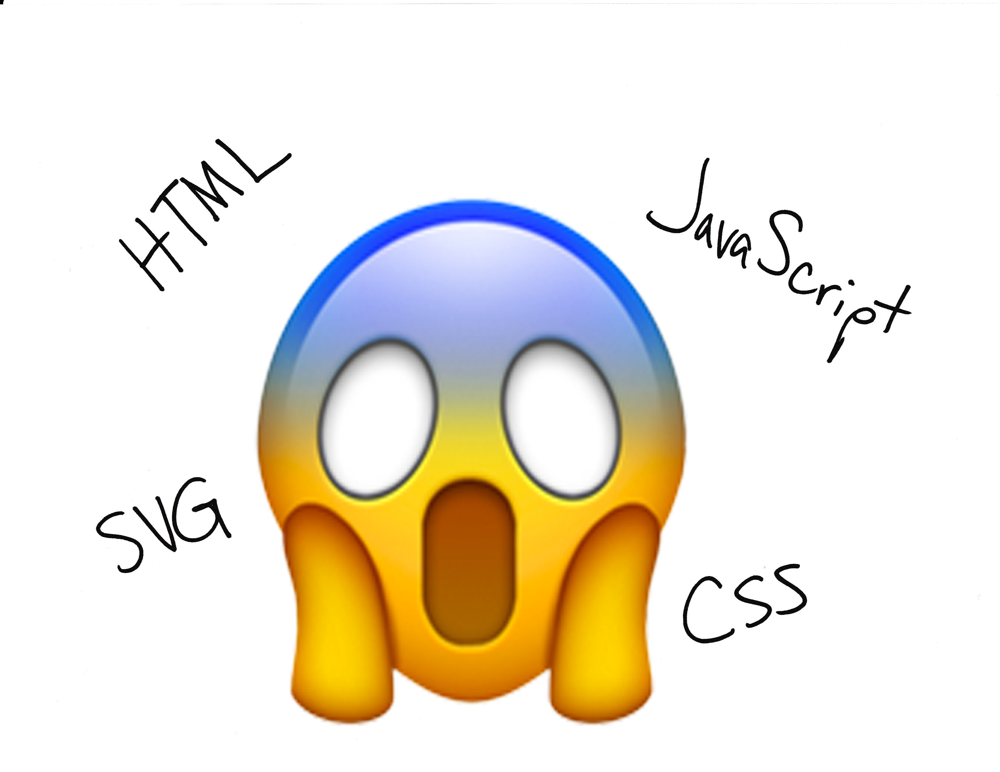
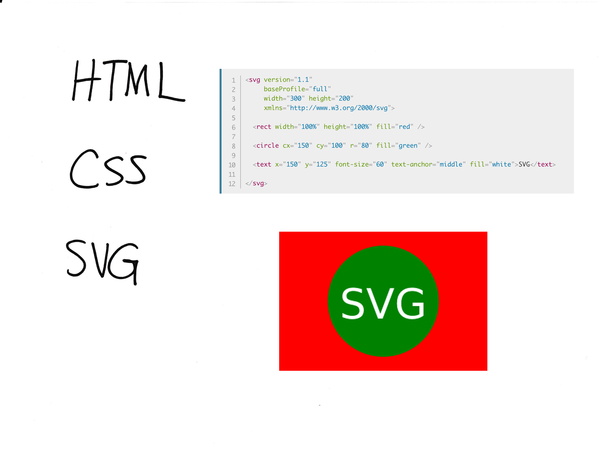

<!-- .slide: class="titleslide" -->

# Data Visualization

## AJ Christensen
## Spring 2019
## Lecture 10

---

## Today

 * Communication with an Audience
 * Final project
 * Publishing
   * D3.js
   * Idyll
   * Github Pages

---

## Three Classes of Visualizations

1. Viz for Self
1. Viz for Experts
1. Viz for the Public

---

## Viz for Self

There are no rules!

notes:
Labels don't matter. Colors don't have to look nice. Interactivity doesn't have to be fast. Here we are just trying to get something on screen that represents the data. Often this is challenge enough.

As the designer, you know what choices you have made, so "elegant design" isn't a huge deal - although don't go too crazy or you could make things more confusing for yourself.

---

## Viz for Self

notes:
I think this is a great example. We used 3D software to make a 2D plot, and arranged points to look like a bar chart even though they were rendered as individual points - aka a scatter plot.

It just had to work, and we used the most convenient software.

---

## Viz for Self

Let's talk about exploration.

 * What are characteristics of data that would influence how you visualize it?
 * What information do you have that would be visually interesting?
 * What information do you not have that you need to understand the importance of the data?

Example: A banking database where each record is a bank transaction and the fields include date, deposit or withdrawal amount, customer id, and the interest rate of the account.

---

## Viz for Self

Let's talk about exploration.

 * What are characteristics of data that would influence how you visualize it?
 * What information do you have that would be visually interesting?
 * What information do you not have that you need to understand the importance of the data?

Example: A spreadsheet of experimental crop growth measurements where each record is a measurement, and the fields include date, plant species, plant id number, number of leaves, plant height, number of internodes, and average leaf length.

notes:
internodes = the number of "generations" of a plant, aka how many branches come off the main stem. 

---

## Viz for Self

Let's talk about exploration.

 * What are characteristics of data that would influence how you visualize it?
 * What information do you have that would be visually interesting?
 * What information do you not have that you need to understand the importance of the data?

Example: A computational simulation of a galaxy where each record is a timestep in the evolution of the 3D grid, and the fields include time, X position, Y position, Z position, gas density, gas temperature, gas metallicity, and number of stars.

---

## Viz for Self

What do you want to get out of visualization for yourself?

 * Do you want to find meaning?
 * Do you want to understand how to guide further visualizations?
 * Is the story you want to tell already known to you?
 * What __shortcuts__ can you take?

notes:
shortcut ideas ... subsampling, delete unused fields, use a simpler tool, manually select outliers by hand instead of doing it procedurally

---

## Viz for Experts

To design a visualization for experts, you need to analyze how they process information.

 * What do they know?
 * What conventions will they assume?
 * Are they able to fill in the blanks of information?

---

## Viz for Experts

notes:
Here's a series of visualizations made by or for domain experts that I just had lying around on my laptop.

What are some things you notice they have in common?

---

## Viz for Experts

notes:
Here's a series of visualizations made by or for domain experts that I just had lying around on my laptop.

What are some things you notice they have in common?

---

## Viz for Experts

notes:
Here's a series of visualizations made by or for domain experts that I just had lying around on my laptop.

What are some things you notice they have in common?

---

## Viz for Experts

notes:
Here's a series of visualizations made by or for domain experts that I just had lying around on my laptop.

What are some things you notice they have in common?

---

## Viz for Experts

notes:
Here's a series of visualizations made by or for domain experts that I just had lying around on my laptop.

What are some things you notice they have in common?

---

## Viz for Experts

Experts often want to interrogate the data themselves.

How can they do that?
 * Linked Dashboards
 * Side-by-side comparison plots
 * Text annotation with specific values listed
 * Color bar annotation

notes:
ask students - other ideas? what about interactivity? (Interactivity needs to be decent)

---

## Viz for Experts

Experts are looking to isolate variables to make scientific conclusions.

How can we make visualizations more analytical?
 * Reduce the dimensionality of the image (slices)
 * Viewpoint from "outside the box"
 * Extremely high contrast color choices

notes:
ask students - other ideas? What about animated data?

---

## Viz for the Public

This is what you're most accustomed to, because usually YOU are the public.

notes:
Who here is an expert on the historical accuracy of movies? Do you think this visualization was created for those experts? Or was it created for you? How can you tell?

---

## Jargon

<iframe src="https://player.vimeo.com/video/206139648" width="640" height="360" frameborder="0" webkitallowfullscreen mozallowfullscreen allowfullscreen></iframe>

<a href="https://vimeo.com/206139648">Jaret before and after</a> from <a href="https://vimeo.com/aldacenter">Alan Alda Center</a> on <a href="https://vimeo.com">Vimeo</a>.

---

## Jargon

Definition: Special words or expressions that are used by a particular profession or group and are difficult for others to understand.

notes:
When working with experts on their data, they will often try to use words that are specific to their field. As a data communicator, it's your job to decipher that jargon and make it more approachable to the public.

---

## Jargon

[xkcd.com/1133](xkcd.com/1133)

notes:
This XKCD webcomic makes fun of how much jargon scientists use. He tries to explain NASA's Saturn V rocket using only the 1000 most common words in the English language. 

He actually wrote a whole book about science this way called "Thing Explainer."

---

## Jargon

[Simple Writer](https://xkcd.com/simplewriter/)

notes:
And here's a neat tool he created to help you write your own!

Before:
"The Advanced Visualization Lab creates cinematic treatments of supercomputer data for immersive displays."

After:
"The very good picture making team creates movies of huge computer information for screens you can be inside of."

---

## Storytelling

Let's just get it out there: humans don't respond to data. They respond to stories.

Which of these do you care about more?
 * Global average atmospheric carbon dioxide is 405 ppm.
 * Polar bears are dying because the ice they use to hunt is melting.

notes:
In visualization, we really want to tell a story, not just a list of facts.

---

## Storytelling

Why is that?

notes:
Emotional response to storytelling is an evolutionary trait humans developed to form stronger social bonds and learn from each other's experience.

---

## Storytelling

Freytag's Pyramid

notes:
A story needs setup, conflict, and resolution. One thing many novice storytellers forget is to have a resolution or ending. You need to wrap it up in a neat package!

---

## Storytelling

Characters and Conflict
 * People as subjects: Two political candidates are battling for office
 * People as researchers: Dr. Smith is trying to cure cancer
 * Objects as characters: The protons are trying to push their way to the sun's surface

---

## Know your Audience

<iframe width="853" height="480" src="https://www.youtube.com/embed/opqIa5Jiwuw" frameborder="0" allow="accelerometer; autoplay; encrypted-media; gyroscope; picture-in-picture" allowfullscreen></iframe>

---

## Know your Audience

What do you know about them?
 * Age
 * Nationality
 * Occupation
 * Affiliation with a Special Interest / Organization
 * Or is it literally EVERYBODY (web publishing)

notes:
You can hone your narrative for certain audiences. If it's the broadest audience, like for journalism shared online, you need to keep in mind that there will be children, grandparents, experts, politicians, people with money, etc all in the audience.

---

## Visualization for the Public

Images can be more powerful than words, text, and numbers. Images can tell stories.

notes:
What can you say about this event given the picture? How is this different from an average day on the National Mall in DC?

What is the story of this photograph?

---

## Visualization for the Public

Context is vital for the public.
 * Embed multiple datasets
 * Place something familiar to relate to the unfamiliar
 * Smooth transitions so you can see where you've come from and where you're going to

notes:
This is different from a visualization for Experts where you usually want to isolate the dataset.

---

## Visualization for the Public

Context is vital for the public.

notes:
The AVL created this sequence for a movie, which originally moved much slower on a large screen, and had a narrator explaining the sequence. Someone recaptured it and made it into a gif, sharing it on reddit with the caption "A simulation of the Earth's moon being formed."

What context might have been lost?

How well does the imagery speak for itself?

---

## Visualization for the Public

Identifying the narrative
 * Do you first find data, or first find a story?
 * What is the difference between the data narrative and a narrative for the public?

notes:
Typically we will start with a dataset, and then build a narrative around it, and seek out more data to build context.

Data narrative = what the data collector is researching

Public narrative = what makes an interesting story and provides context

---

## Visualization for the Public

 1. Aesthetics Matter
 1. Interactivity should not have any lag or latency
 1. Relative values are often more important than specific values
 1. Limit the amount of text/reading
 1. Limit the amount of information being packed in

---

## Visualization for the Public

 * [Election Forecast - fivethirtyeight](https://projects.fivethirtyeight.com/2018-midterm-election-forecast/senate/)
 * [Online Dating - okCupid](https://theblog.okcupid.com/exactly-what-to-say-in-a-first-message-2bf680806c72)
 * [DiCaprio Love Life - reddit](https://www.reddit.com/r/dataisbeautiful/comments/azjti7/leonardo_dicaprio_refuses_to_date_a_woman_over_25/)

notes:
What are the narratives of these visualizations? How are they different than just a list of facts?

---

## Idyll

A web-based toolkit for storytelling with data visualizations!

 * Reduce manual coding for interactive articles
 * Integration with D3.js

---

## [D3.js](https://github.com/d3/d3/wiki/Gallery)

A JavaScript library for web-based data visualization

 * Declarative, not imperative (this is better for web coding)
 * Dynamic and interactive
 * Smooth transitions

---

## D3.js

notes:
D3 is meant to be well-integrated into the existing infrastructure of the internet. The worldwide web is a real patchwork of different languages with different syntaxes meant to do different things. Don't let it overwhelm you. They tend to be pretty simple to start, and only get more complicated when you need them to.

---

## D3.js

notes:
HTML or Hypertext Markup Language is the default syntax for websites. It's meant to be structured with tags like "head", "body", "paragraph", and "division". 

It's essentially a skeleton for other functionality to hang off of.

You may see the term DOM or Document Object Model. This is just another name for this skeleton/framework.

---

## D3.js

notes:
CSS or cascading style sheets are how you define how websites are formatted. They do color, indentation, drop shadows, etc. Each CSS call is attached to an HTML tag.

CSS can be called in-line, or from an external file dedicated exclusively to CSS code.

---

## D3.js

notes:
SVG or Scalable Vector Graphics is an XML-based implementation of vector shape drawing that's natively understood by website compilers. It's an easy way to include dynamically rendered, animated, or interactive imagery in a webpage.

---

## D3.js

notes:
JavaScript is a dynamic programming language that runs natively on webpages. If you want to run programming logic in a webpage, you use javascript. If you see interactivity or animated effects on a website, you can generally expect they were written in javascript. 

---

## Idyll

Most of this is hidden from you when writing in Idyll! But it helps to understand the underlying mechanisms.

We will be using D3.js and Idyll for the Final Project to share interactive visualizations connected in a narrative.

notes:
what are the limits to data size in Idyll and the web browser?

---

## Final Project

Your final project is due on April 29th.

That is just about a month.

You will have three components:

1. Viz for Self (Due April 8)
1. Viz for Experts (Due April 15)
1. Viz for the Public (Due April 22)
1. Presentation to the class (April 29)

---

## Final Project: Part 1

Due by class on April 8th, submitted via Moodle in a Jupyter notebook.

 * Organize yourselves into Groups of 4 (there will be one group of 3). If you don't have a group in mind, I can assign you to a group as well.
 * Identify 3 datasets to explore (2 datasets if you’re in a group of 3) in Jupyter notebooks
   * Find a dataset that has a bare minimum of 100 records, and at least 5 fields. Ideally it will have even more. Remember, you want enough information that you can tell a *story* about the data.
   * You will have an easier time if you explore datasets that are from similar fields or industries.
   * Check out this [Google Doc](https://docs.google.com/document/d/15UJinT5XokAHXd9fQAYD8f6d3vEkR6kJMq8kswmkOhY/edit?usp=sharing) on Example data locations

---

## Final Project: Part 1 (cont)

Your datasets need to be submitted as well.  To do this, include this information in your Jupyter notebook:

 * What is the "name" of the dataset?
 * Where did you obtain it?
 * Where can we obtain it?  (i.e., URL)
 * What is the license of the dataset?  What are we allowed to do with it?
 * How big is it in file size and in items?

---

## Final Project: Part 1 (cont)

As a group, you should submit:

Code:
 * 3 separate jupyter notebooks with unguided exploration of a dataset (2 notebooks for groups of 3). Each notebook should have at least 3 plots featuring different records and fields in the data, but they do not have to be pretty.
 * Each notebook should have information about the dataset at the top
 * Do not delete any cells, just comment them out. Show your work.

---

## Final Project: Part 1 (cont)

As a group, you should submit:

Prose:
 * One paragraph each for the three datasets describing what you discovered in the data.
 * One paragraph analyzing which of the 3 datasets your group intends to focus on and why it has the best storytelling potential.
 * A brief description of which group members completed which tasks. There should be an equal division of labor. Each group member will be graded based on how well they completed their tasks. If one group member clearly does less work, they may receive a grade deduction. 

---

## Final Project: Part 2

Due by class on April 15th, submitted via Moodle in a Jupyter notebook.

As a group you should submit:

Code:
 * Jupyter notebook with an interactive dashboard that helps an expert explore your dataset thoroughly. There should be 4 linked visualizations all exploring the same dataset and all visible at the same time. (3 linked visualizations for teams of 3.)
 * Do not delete any cells, just comment them out. Show your work.

---

## Final Project: Part 2 (cont)

As a group you should submit:

Prose:
 * One paragraph explaining how to use the dashboard you created, to help someone who is not an expert understand your dataset. 
 * A list of 5 (or more) contextual datasets you have identified, links to where they reside, and a sentence about why they might be useful in telling the final story.
 * A brief description of which group members completed which tasks. There should be an equal division of labor. Each group member will be graded based on how well they completed their tasks. If one group member clearly does less work, they may receive a grade deduction.

---

## Final Project: Part 3

Due by class on April 22nd, submitted in a repository that is rendered as HTML for the web.

You can approach this as:
 * Raw HTML
 * Idyll
 * Github pages
 * Embedded Jupyter notebooks
 * Others?

---

## Final Project: Part 3 (cont)

You will be writing an interactive data visualization article aimed at the public. Your article should feature:
  * A compelling title and list of authors.
  * At least one central interactive visualization featuring your primary dataset. This can be similar to what you submitted in the last phase, but does not need to be a dashboard. Remember, this is for the public so it should be large and friendly.
  * At least two contextual visualizations featuring 2 of the 5 contextual datasets you identified in the last phase. These visualizations can be static straightforward plots, but they should still be attractive. Most importantly, they should help tell a story.
  * At least 3 paragraphs of connective information to help a novice understand what is happening in your datasets.
  * Citations of all the data sources used and information for the reader to be able to find those datasets themselves.

---

## Final Project: Part 3 (cont)

As a group, you should submit:

Code:
 * Either a ZIP file with a directory of code OR a GitHub URL where the code is stored. The code should be a repository that is rendered as HTML in a web browser.
 * You can receive extra credit for including more than the required minimum. This can include making more than one visualization interactive, incorporating more than 3 visualizations, or incorporating more than 3 datasets into the three visualizations.
 * Look to data visualization articles on fivethirtyeight.com, the New York Times website, or elsewhere for inspiration.

---

## Final Project: Part 3 (cont)

As a group, you should submit:

Prose:
 * A brief description of which group members completed which tasks. There should be an equal division of labor. Each group member will be graded based on how well they completed their tasks. If one group member clearly does less work, they may receive a grade deduction.

---

## Final Project: Presentation

Your group will have 10 minutes to present your article to the class:
 * You should spend 5 minutes discussing the datasets you found, the story you wanted to tell, and the process you used to create the final article. 
 * You should spend 2 minutes discussing what discoveries you made about the dataset while working with it. 
 * You should spend 1 minute discussing future directions, or improvements you would like to see. 
 * You should spend 2 minutes answering questions from the rest of the class.
Your whole group will receive the same grade. You will be graded on whether each team member had a chance to speak, and on how well you addressed each of the prompts above. The final presentation is worth 10 points.

---

## Final Project: Grading

 * Part 1 - 15 points (exploration of datasets = 10 points, description of discoveries = 5 points)
 * Part 2 - 15 points (dashboard + description = 10 points, 5 contextual datasets = 5 points)
 * Part 3 - 15 points + 5 (3 plots, one interactive = 5 points, aesthetics = 5 points, storytelling = 5 points, 5 extra credit points possible)
 * Presentation - 10 points

Total possible: 60 / 55

---

## Form your groups now!
