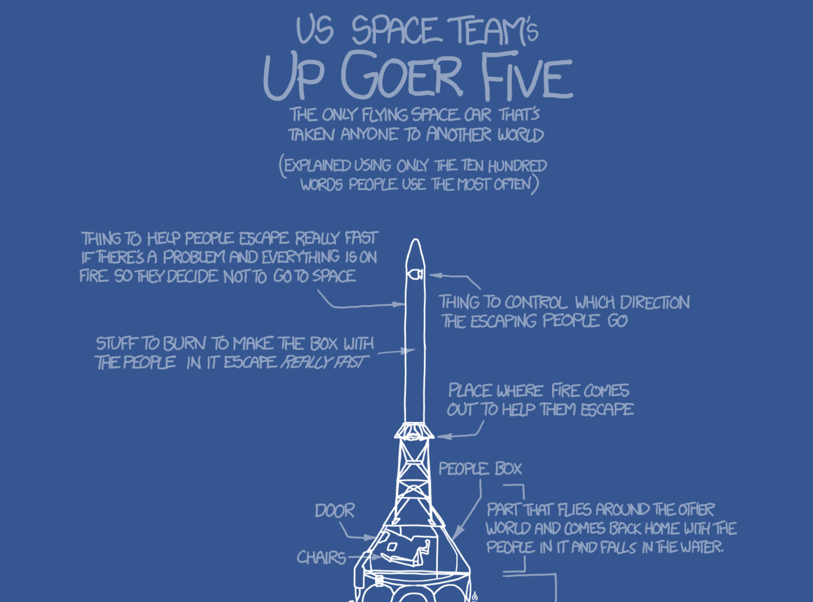

<!-- .slide: class="titleslide" -->

# Data Visualization
<div style="height: 6.0em;"></div>
## AJ Christensen
## Spring 2019
## Lecture 10

---

## Today

 * Communication with an Audience
 * Final project
 * Publishing
   * D3.js
   * Idyll
   * Github Pages

---

## Three Classes of Visualizations

1. Viz for Self
1. Viz for Experts
1. Viz for the Public

---

## Viz for Self

There are no rules!


notes:
Labels don't matter. Colors don't have to look nice. Interactivity doesn't have to be fast. Here we are just trying to get something on screen that represents the data. Often this is challenge enough.

As the designer, you know what choices you have made, so "elegant design" isn't a huge deal - although don't go too crazy or you could make things more confusing for yourself.

---

## Viz for Self

Let's talk about exploration.

 * What are characteristics of data that would influence how you visualize it?
 * What information do you have that would be visually interesting?
 * What information do you not have that you need to understand the importance of the data?

Example: A banking database where each record is a bank transaction and the fields include date, deposit or withdrawal amount, customer id, and the interest rate of the account.

---

## Viz for Self

Let's talk about exploration.

 * What are characteristics of data that would influence how you visualize it?
 * What information do you have that would be visually interesting?
 * What information do you not have that you need to understand the importance of the data?

Example: A spreadsheet of experimental crop growth measurements where each record is a measurement, and the fields include date, plant species, plant id number, number of leaves, plant height, number of internodes, and average leaf length.

notes:
internodes = the number of "generations" of a plant, aka how many branches come off the main stem. 

---

## Viz for Self

Let's talk about exploration.

 * What are characteristics of data that would influence how you visualize it?
 * What information do you have that would be visually interesting?
 * What information do you not have that you need to understand the importance of the data?

Example: A computational simulation of a galaxy where each record is a timestep in the evolution of the 3D grid, and the fields include time, X position, Y position, Z position, gas density, gas temperature, gas metallicity, and number of stars.

---

## Viz for Self

What do you want to get out of visualization for yourself?

 * Do you want to find meaning?
 * Do you want to understand how to guide further visualizations?
 * Is the story you want to tell already known to you?
 * What __shortcuts__ can you take?

notes:
shortcut ideas ... subsampling, delete unused fields, use a simpler tool, manually select outliers by hand instead of doing it procedurally

---

## Viz for Experts

To design a visualization for your peers, you need to step back and think about
the common shared language you have with them.

 * What do they know?
 * What conventions will they assume?
 * Are they able to fill in the blanks of information?

---

## Viz for Experts

Experts often want to interrogate the data themselves.

How can they do that?
 * Linked Dashboards
 * Side-by-side comparison plots
 * Text annotation with specific values listed
 * Color bar annotation

notes:
ask students - other ideas? what about interactivity? (Interactivity needs to be decent)

---

## Viz for Experts

Experts are looking to isolate variables to make scientific conclusions.

How can we make visualizations more analytical?
 * Reduce the dimensionality of the image (slices)
 * Viewpoint from "outside the box"
 * Extremely high contrast color choices

notes:
ask students - other ideas? What about animated data?

---

## Viz for the Public

This is what you're most accustomed to, because usually YOU are the public.


notes:
Who here is an expert on the historical accuracy of movies? Do you think this visualization was created for those experts? Or was it created for you? How can you tell?

---

## Jargon

<iframe src="https://player.vimeo.com/video/206139648" width="640" height="360" frameborder="0" webkitallowfullscreen mozallowfullscreen allowfullscreen></iframe>
<p><a href="https://vimeo.com/206139648">Jaret before and after</a> from <a href="https://vimeo.com/aldacenter">Alan Alda Center</a> on <a href="https://vimeo.com">Vimeo</a>.</p>

---

## Jargon

Definition: Special words or expressions that are used by a particular profession or group and are difficult for others to understand.


notes:
When working with experts on their data, they will often try to use words that are specific to their field. As a data communicator, it's your job to decipher that jargon and make it more approachable to the public.

---

## Jargon



[xkcd.com/1133](xkcd.com/1133)

notes:
This XKCD webcomic makes fun of how much jargon scientists use. He tries to explain NASA's Saturn V rocket using only the 1000 most common words in the English language. 

He actually wrote a whole book about science this way called "Thing Explainer."

---

## Jargon

[Simple Writer](https://xkcd.com/simplewriter/)

notes:
And here's a neat tool he created to help you write your own!

Before:
"The Advanced Visualization Lab creates cinematic treatments of supercomputer data for immersive displays."

After:
"The very good picture making team creates movies of huge computer information for screens you can be inside of."

---

## Storytelling

Let's just get it out there: humans don't respond to data. They respond to stories.

Which of these do you care about more?
 * Global average atmospheric carbon dioxide is 405 ppm.
 * Polar bears are dying because the ice they use to hunt is melting.

notes:
In visualization, we really want to tell a story, not just a list of facts.

---

## Storytelling

Why is that?


notes:
Emotional response to storytelling is an evolutionary trait humans developed to form stronger social bonds and learn from each other's experience.

---

## Storytelling

Freytag's Pyramid


notes:
A story needs setup, conflict, and resolution. One thing many novice storytellers forget is to have a resolution or ending. You need to wrap it up in a neat package!

---

## Storytelling

Characters and Conflict
 * People as subjects: Two political candidates are battling for office
 * People as researchers: Dr. Smith is trying to cure cancer
 * Objects as characters: The protons are trying to push their way to the sun's surface

---

## Know your Audience

<iframe width="853" height="480" src="https://www.youtube.com/embed/opqIa5Jiwuw" frameborder="0" allow="accelerometer; autoplay; encrypted-media; gyroscope; picture-in-picture" allowfullscreen></iframe>

---

## Know your Audience

What do you know about them?
 * Age
 * Nationality
 * Occupation
 * Affiliation with a Special Interest / Organization
 * Or is it literally EVERYBODY (web publishing)

notes:
You can hone your narrative for certain audiences. If it's the broadest audience, like for journalism shared online, you need to keep in mind that there will be children, grandparents, experts, politicians, people with money, etc all in the audience.

---

## Visualization for the Public

Images can be more powerful than words, text, and numbers. Images can tell stories.


notes:
What can you say about this event given the picture? How is this different from an average day on the National Mall in DC?

What is the story of this photograph?

---

## Visualization for the Public

Context is vital for the public.
 * Embed multiple datasets
 * Place something familiar to relate to the unfamiliar
 * Smooth transitions so you can see where you've come from and where you're going to

notes:
This is different from a visualization for Experts where you usually want to isolate the dataset.

---

## Visualization for the Public

Context is vital for the public.


notes:
The AVL created this sequence for a movie, which originally moved much slower on a large screen, and had a narrator explaining the sequence. Someone recaptured it and made it into a gif, sharing it on reddit with the caption "A simulation of the Earth's moon being formed."

What context might have been lost?

How well does the imagery speak for itself?

---

## Visualization for the Public

Identifying the narrative
 * Do you first find data, or first find a story?
 * What is the difference between the data narrative and a narrative for the public?

notes:
Typically we will start with a dataset, and then build a narrative around it, and seek out more data to build context.

Data narrative = what the data collector is researching

Public narrative = what makes an interesting story and provides context

---

## Visualization for the Public

 1. Aesthetics Matter
 1. Interactivity should not have any lag or latency
 1. Relative values are often more important than specific values
 1. Limit the amount of text/reading
 1. Limit the amount of information being packed in

---

## Idyll

A HTML-based system for storytelling with data visualizations

---

## Final Project

Your final project is due on December 5.

That is just over a month.

You will have three components:

1. Viz for Self (Due November 14)
1. Viz for Peers (Due November 21)
1. Viz for Others (Due December 5)

---

## Final Project: Part 1

This will be graded individually.  Due by class on November 14, submitted via
Moodle.  Submit in a Jupyter notebook.

 * Organize yourselves into groups of 4
 * Identify a dataset to explore.
   * This will be iterative!  You probably won't get one you like on the first
     try.
   * Check out sources like [data.world](https://data.world/),
     [data.illinois.gov](https://data.illinois.gov/),
     [data.gov](https://data.gov/),
     [developer.marvel.com](https://developer.marvel.com/),
     [IDB](https://databank.illinois.edu/), etc.
 * Explore the dataset in a Jupyter notebook.  **Do not delete any cells.**
 * Summarize the characteristics of the dataset in words: what does it
   represent, what are the fields/columns/rows, what data types are they, etc

---

## Final Project: Part 1 (cont)

Your datasets need to be submitted as well.  To do this, include this
information in your Jupyter notebook:

 * What is the "name" of the dataset?
 * Where did you obtain it?
 * Where can we obtain it?  (i.e., URL)
 * What is the license of the dataset?  What are we allowed to do with it?
 * How big is it in file size and in items?

---

## Final Project: Part 2

This will be graded per group.  Submit in a Jupyter notebook.

 * Using your dataset, generate visualizations that explore the data in a
   guided way.
 * Your first component was focused on exploring the data in an unguided way.
   This component is about visualizing the data in a guided way.
 * Construct visualizations that explore each aspect you identified, with
   discussion and descriptions.
 * If you can identify improvements to the visualizations that come from
   interactivity, implement that.
 * The visualizations should utilize visual language relevant for "Viz for
   Peers."
    * Each and every plot should contain all relevant information: appropriate
      units, labeling, etc
    * Annotate and narrate particular pieces of interest (if there are any)
    * Use standard visual representations and augment these if necessary

---

## Final Project: Part 3

You will submit this as your final project and will present it to the class.

You may submit one or more of the following items, but they *must* be in a
repository that is rendered as HTML.  More information will be coming shortly.

This component will include a "for others" visualization that is deeply
narrative with appropriate interactive (or static) content and shared on a
website.

Some possible ways to approach this:

 * Infographic
 * Idyll
 * Jupyter notebook
 * Raw HTML

---

## Idyll

Idyll is a reactive markup language for visualization and narrative documents.

[idyll-lang.org](idyll-lang.org)

---

## Idyll Again

Go to your Jupyter Hub environment.  Create a terminal.

```
source activate /home/shared/sp18-is590dv/conda_envs/is590dv-default/
yo idyll
```

This will autogenerate a project for you.  Go into that directory and type `npm
start`.

This will watch for changes and rebuild.  It tells you that you can connect to
it in a web browser but **this is a lie**.  You have to browse to the location
in your tree view and then go to the directory `build` and choose `index.html`
in the Jupyter main page.

---

## Breakout: Birth Names (Part 1)

Last week, we talked about how one would represent a birth name browser.

What did you come up with?

---

## Breakout: Birth Names (Part 2)

On the Jupyterhub, you have access to a `names` directory:

```
/home/shared/sp18-is590dv/data/names
```

This has a bunch of files, with the counts of birth names per year and
categorized by sex assigned at birth.

---

## Breakout: Birth Names (Part 3)

You are to break into groups and decide how to proceed.  We need to:

1. Explore the data
1. Generate an interactive visualization
1. See if we can get it into Idyll

---

## Idyll and Data

What are the barriers to using Idyll with really big, unfiltered data?
