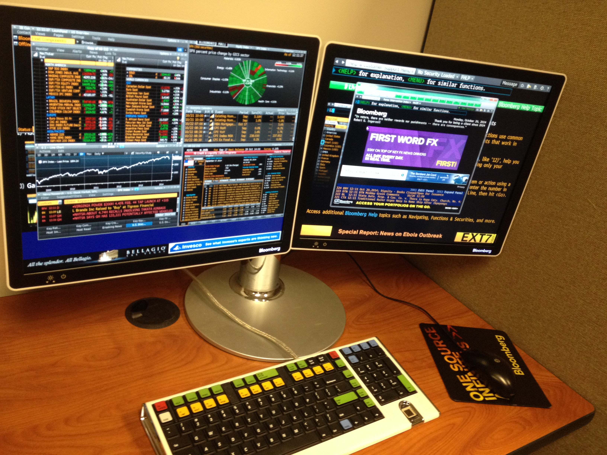

<!-- .slide: class="titleslide" -->

# Data Visualization
<div style="height: 6.0em;"></div>
## Jill P. Naiman
## Spring 2019 (Online)
## Lecture 11

---

## Warm-Up Activity

 1. What is the visualization trying to show?
 1. What are its methods?
 1. What are the strengths / weaknesses?

[Flaws of a Boeing 737 Max](https://www.nytimes.com/interactive/2019/03/29/business/boeing-737-max-8-flaws.html)

---

## If you are on campus: April 22nd at NCSA, 9:30am

In-person class is having live demos from the Advanced Visualization Lab.  Feel free to join!

We will meet in 1005 on the ground floor.

The address is 1205 W Clark St, just north of the Siebel computer science building.

---

## Today

 * Validation
 * Publishing
 * More on Idyll
 * github.io pages

---

## Validation

How do you know your visualization is actually useful? Is it...

 * More comprehensive or contextual
 * More revealing or educational
 * More fun or pleasant to use
 * More efficient or fast

notes:
What do we even mean "more than"? More than what?

More than just looking at numbers?

More than a previous visualization?

More than the state of the art?

---

## Validation

Why is validating a visualization important?

 1. The design space is huge
 1. Most designs are ineffective
 1. User-focused design is often an afterthought
 1. The "quality" of a visualization is subjective

notes:
Can you all think of a user experience that drives you nuts in your daily life? A pointless button in your email? A door that opens the wrong way? A noisy piece of machinery?

---

## Validation

What can a visualization designer get wrong?

 * Misunderstand the needs of the domain expert or educator
 * Interpret the data incorrectly
 * Represent the data in a visually confusing way
 * The software is too laggy or difficult to use in a practical setting

notes:
Any other ideas?

---

## Methods of Validation

Before developing your visualization system:

 1. Observe and interview target users or audience members
 1. Justify interaction design plans against the academic literature and existing tools
 1. Do an analysis of the complexity of the system

---

## Methods of Validation

After developing your visualization prototype:

 1. Measure system performance
 1. Usability studies (formal and/or informal)
 1. Measure human time to complete a task, or number of user errors
 1. Do a field study - perhaps even collect user data with the system

notes:
You don't have to do all of these all the time, but depending on the project they might all be a good idea

Also, remember to respect user privacy when collecting user data. This is extremely sensitive.

---

## Methods of Validation:

After publishing your visualization:

 1. Observe adoption rates
 1. Solicit anecdotal user feedback

notes:
This is especially valuable if you expect to have to make more than one visualization in your life. Building intuition for what works and what doesn't is a large part of the career success of a visualization designer.

The Advanced Visualization Lab interacts with audiences through lab demos and conference talks regularly to collect this kind of feedback.

---

## Example informal Validation: AVL


notes: here is an example of an informal validataion that the AVL does a lot of.  

Here the data visualizers are doing a showing of their movie and asking audiences for feedback - both on what they liked and didn't like, but also on what they learned.

---

## Validation in Final Project

Your peers will ask you questions at the end of your presentation. 

Try to understand what is working for them and what is not. It will help hone your instincts.

---

## Publishing

Your stunning visualizations will do no one any good if they reside only on your laptop. How do you get them out there?

 * The Internet
 * In-Person Presentation
 * Popular Media
 * Physical Objects

---

## Publishing for the Web

 * Raw HTML, CSS, SVG, and JavaScript
 * Content Management Systems
 * Idyll
 * GitHub Pages
 * Social Media
 
notes: we'll be mostly playing with idyll and github pages, but we'll also make a bit of content that you can share on social media (your webpages certainly can be shared)

---

## Raw HTML, CSS, SVG, and JavaScript

Pros:
 * Less of a learning curve for individual parts (though, more to put them into a final webpage)
 * Lots of documentation

Cons:
 * No reproducibility
 * LOTS of code writing
 * Locked in time - no software updates

---

## Content Management Systems

There are dozens of these, for instance: 
 * Squarespace
 * Wordpress
 * Wix
 * Drupal


notes:
Squarespace seems to be the favorite of small businesses. Drupal is great for large businesses.

---

## Content Management Systems

Pros:
 * Pre-built templates that might be updated by the development community
 * Plugins with visualization tools
 * Content updates are done by GUI

Cons: 
 * Visualization tools not automatically built in
 * More effort because they're meant for whole websites
 * Code (especially for plugins) can become outdated and incompatible

---

## Idyll

Pros:
 * Visualization-ready, compatible with Vega-Lite, D3.js, and Flourish
 * Modern features and design

Cons:
 * Less common syntax (Markdown)
 * Not well-documented
 * open source means less guarantee of long-term support in the future


---

## GitHub Pages

Pros: 
 * Community driven (there's lots of support)
 * Free hosting

Cons:
 * Community driven (there can be bugs and surprises)
 * You only get the one webpage


---

## Social Media

How can visualization be distributed on social media?
 * Images can be shared everywhere
 * Embedded videos using YouTube, Vimeo, FB video, etc
 * [SketchFab](https://sketchfab.com) scenes can be shared on Reddit, Facebook, and Twitter
 * Your webpages can be linked of course!

notes:
The internet is visual, and increasingly about video (or at least animated gif)

Sketchfab is a great service for viewing 3D content in a web browser.

---

## Social Media

Pros:
 * Huge audience
 * Easy to target the communities you're trying to communicate with

Cons:
 * Limited functionality, especially with respect to interactivity
 * Visualizations have shorter expiration date
 * No quality control

---

## Sharing Visualizations in Live Presentation

 * Jupyter Notebook (cleaned up)
 * PDF (3D capability!)
 * Powerpoint (3D capability!)
 * Mobile App
 * Printed on paper (300dpi, serif fonts, line thickness)
 * Custom in-house software (e.g. Bloomberg Terminal)



notes:
Some of these are a bit outdated, but sometimes corporate environments require you to speak the language management wants you to speak.

---

## Sharing Visualizations through Popular Media

 * Videos and films


notes:
This approach usually relies on more stylized treatments called "motion graphics".

Often the film approach depends on working with someone who produces movies who is looking for content. But some people will produce their own content (especially in short documentary format) for internet release.

---

## Sharing Visualizations through Popular Media

 * Museum exhibits


notes:
You get much more control when working with experts in museums, and you get to see your visualization blown up to huge sizes.

You still need to make a visualization that even a very small child will understand though.

---

## Sharing Visualizations through Popular Media

 * App Stores


Image from <a href="http://worldwidetelescope.org/webclient/">World Wide Telescope</a>

notes:
This is how you can reach people through their phones and popular new media like virtual reality.

---

## Making Visualization

 * 3D printing (check out [Thingiverse](https://www.thingiverse.com/) or a [NASA 3D print](https://nasa3d.arc.nasa.gov/detail/cassiopeiaA))
 * Printed leggings (check out [Bags of Love](https://www.bagsoflove.com/))
 * Blankets
 * Whatever you can think of 
    * Visit [Instructables.com](https://instructables.com) for ideas!


notes: here the blanket is the daily temperature recorded every day for a year 

the leggings are a scientific viz - the leg on the left is density and the right is temperature, taken from a simulation of stars forming in a gaseous region

with 3D printing, you can make "surfaces" in your dataset (more on that when we chat about scientific viz) and then 3D print these things

---

## Technical Limitations

 * Memory
 * Screen Size
 * Interaction technique (mouse and keyboard vs touchscreen)
 * Disk space

---

## More Idyll...

---

## Idyll Motivation: Interactive articles

Pros:
 * More engaging for readers
 * Large audience and acclaim
 * Potentially more efficient for learning about new topics

Cons:
 * Hard and expensive to create
 * Custom Javascript and HTML
 * Difficult to design and implement well
 * Hard to work with editorial collaborators (not in CMS’s)

---

## Idyll: getting your viz on the web

We'll be using github pages (github.io) to do this.

The steps will be:

 * Create the repository ```[username].github.io``` 
 * Clone this repository
 * Fill it with your Idyll build
 * Push your repository
 * PROFIT

---

## ~~Idyll~~ Jupyter notebooks: getting your viz on the web

We'll be using github pages (github.io) to do this.

The steps will be:

 * Create the repository ```[username].github.io``` 
 * Clone this repository
 * Fill it with your ~~Idyll build~~ Jupyter notebook & dataset
 * Push your repository
 * Use [mybinder.org](https://mybinder.org/) to create a link to your notebook
 * PROFIT

notes: the process for building a jupyter notebook will be very much the same, the steps are just a little different

---

## github.io for publishing

Step 1: Create/login to your github account

(We'll also do this "live" in the coding section of class)

---

## github.io for publishing

Step 2: Create new repository


---

## github.io for publishing

Step 2: Create new repository


---

## github.io for publishing

Step 3: Name your new repository as ```[username].github.io```


---

## github.io for publishing

Step 3: Name your new repository as ```[username].github.io```


notes: the name is important here!!

---

## github.io for publishing

Step 4: Clone your repository


---

## github.io for publishing

Step 4: Clone your repository


notes: make note of your git name, we'll use this for "cloning" our github repo

---

## github.io for publishing

Step 5: Clone your repository
 * In command line do: ```git clone YOUR_REPO_LINK```

Step 6: Copy contents of your Idyll build to this directory
 * ```cp -r MY_IDYLL_FILE/build MY_REPO_DIR```

---

## github.io for publishing

Step 7: Add these files to your repo officially
 * ```git add -A```
 
Step 8: Commit these files (say what you are doing)
 * ```git commit -m "my first add"
 
Step 9: Push to your online repo
 * ```git push```
 
Step 10: wait for your website to build and then check it out!
 * Link: ```https://YOUR_GITHUB_USER_NAME.github.io/```

---

## github.io for publishing Jupyter notebooks

Steps are essentially the same, but instead of your Idyll build directory, you add in your notebook file.

Then, you need to link this on [mybinder.org](https://mybinder.org)

---

## github.io for publishing Jupyter notebooks


notes: Here, we just put in a link to our "home" github.io page and we also put a link to our specific notebook file

Then we can press "launch" and away we go!

Also, for some cases you can use "nbviewer" to render notebooks.  However, this doesn't work with the latest version of ipywidgets and bqplot. Hopefully that will change soon!

---

## Final Project: Part 2

Due by class on April 11th, submitted via Moodle in a Jupyter notebook.

*Using your dataset from Part 1:*

Submit code and a writeup (either seperate or within the notebook):

Code:
 * Jupyter notebook with an interactive dashboard that helps an expert explore your dataset thoroughly. 
 * There should be a "dashboard" type aspect to this - i.e. a linked view exploring your dataset in an interactive way
 * Do not delete any cells, just comment them out. Show your work.

---

## Final Project: Part 2 (cont)

Also submit:

Prose:
 * One paragraph explaining how to use the dashboard you created, to help someone who is not an expert understand your dataset. 
 * A list of 1 or more contextual datasets you have identified, links to where they reside, and a sentence about why they might be useful in telling the final story.
 
 Per usual, we will have a group google doc for this assignment.  

---

## Let's get into some Idyll & publishing!

