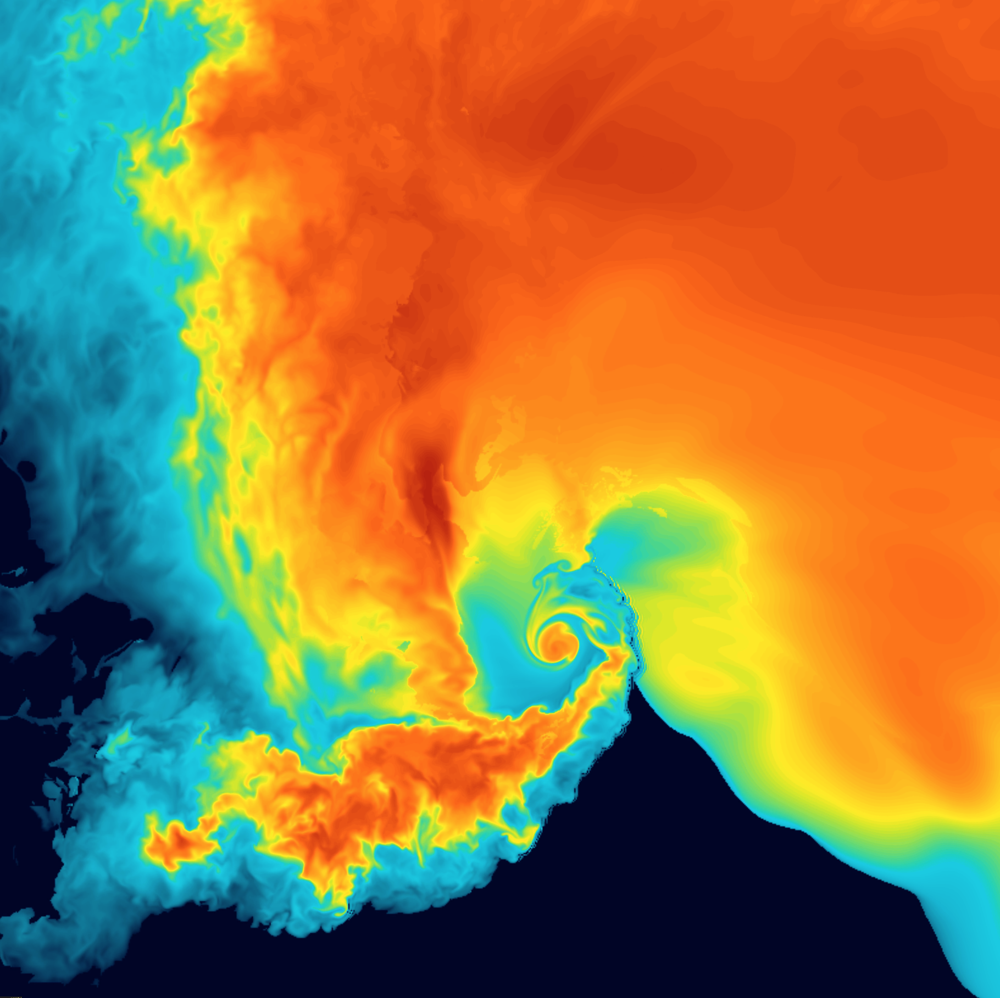
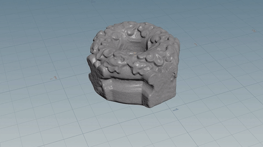
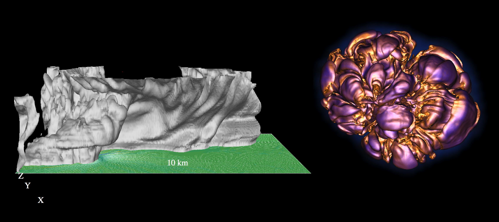

<!-- .slide: class="titleslide" -->

# Data Visualization

## AJ Christensen
## Spring 2019
## Lecture 12

---

## Warm-Up Activity

 1. What is the visualization trying to show?
 1. What are its methods?
 1. What are the strengths / weaknesses?
 1. Would you know how to make something like this?

http://biologylabs.utah.edu/farmer/index_dinosaur.html

---

## Today

 * Scientific Visualization

---

## Information Visualization

So far: Spatial encoding is chosen by the designer

---

## Scientific Visualization

Sci Viz: Spatial encoding is provided in the data

---

## Spatial Data

 1. Geometry
 1. Volumetric Fields

---

## Spatial Data

 1. Geometry
   * Polygons

notes:

---

## Spatial Data

 1. Geometry
   * Polygons
   * Point Clouds

notes:
point clouds can be static, or they can have physics which make them a "particle system".

---

## Spatial Data

 2. Volumetric Fields

notes:
How do you represent something like this with data?

You need scalars to describe things like material.

You need vectors to describe things like motion (velocity). 

---

## Spatial Data

 2. Volumetric Fields
    * Scalar

notes:
This sequence reveals the underlying 3D grids of several scalar fields including:

H1 density

H2 density

photogamma

temperature

metallicity

---

## Spatial Data

 2. Volumetric Fields
    * Scalar

notes:
Fields can be 2D or 3D. Images can be used as 2D data fields.

AVL used this image from the Magellan satellite to create a "displacement map" for this venusian volcano called "Sapas Mons".

2D fields can also be layered in formats common to GIS, or Hollywood formats like EXR.

---

## Spatial Data

 2. Volumetric Fields
    * Scalar
    * Vector

[Windy Weather Map](https://www.windy.com)

notes:
Windy is an interactive wind velocity map. It's always interesting to look at, but especially during hurricane season. I captured this image as Hurricane Maria flirted with the East coast in Sept 2017.

---

## Spatial Data

 2. Volumetric Fields
    * Scalar
    * Vector

notes:
In this visualization we're seeing 3D velocity streamlines.

We're ALSO seeing a scalar volume called "vorticity" which is directly derived from the velocity field by taking a mathematical operation called the "curl".

---

## Spatial Data

 2. Volumetric Fields
    * Uniform or non-uniform
    * Rectangular or non-rectangular

notes:
Adaptive mesh refinement is an especially efficient 3D storage for datatypes that have small areas of high detail.

---

## Spatial Data Types

 1. Statistical
    * Star species
    * Atom prevalence
 1. Observational
    * Telescope images
    * Microscope images
    * LIDAR
 1. Simulated by computer models
    * First principles physics
    * Astronomy, geology, biology

---

## Visualizing Point Data

 * Dots with scale

---

## Visualizing Point Data

 * Dots with scale
 * Sprites

notes:
All the moving dots in this video are represented by a gaussian splat image. You can see how they are adjusted to be different size and color.

---

## Visualizing Point Data

 * Dots with scale
 * Sprites

notes:
But gaussian blur isn't the only way to put a sprite on a point. This version used text instead.

---

## Visualizing Point Data

 * Dots with scale
 * Sprites
 * Meshing

notes:
This is a test AVL worked on with an SPH "smooth particle hydrodynamics" dataset where we created a surface across points. The surface was generated at a density threshold - aka, it was an infinitely thin shell shrinkwrapped onto all particles that were above a certain density.

---

## Visualizing Polygons

 * Vector lines with width, can be filled

notes:
We're already familiar with this data from MAPS week.

---

## Visualizing Polygons

 * Vector lines with width, can be filled
 * Direct rendering of architectural schematics

notes:
Sometimes you will be given a description of geometric objects that you need to construct.

---

## Visualizing Polygons

 * Vector lines with width, can be filled
 * Direct rendering of architectural schematics
 * Direct rendering of 3D scans (pre-meshed)

notes:
Sometimes you will get something that was originally generated from a point cloud but has already been meshed. Domain experts sometimes have access to better meshing tools, particularly in the realm of 3D scanning.

---

## Visualizing Scalar Fields

 * Slice

notes:
You might remember from Week 5 when we played with this brain scan data - this is only a single image slice out of a 3D gridded dataset.

Even if you're not showing your final visualization as a slice, this is a good step for understanding and troubleshooting. As we've mentioned before, reducing dimensionality makes things clearer to the human brain.

---

## Visualizing Scalar Fields

 * Slice
 * Isosurface

notes:
You have probably seen this type of topographic map where lines indicate elevation. These lines are called isocontours. You can combine isocontours to get isosurfaces.

---

## Visualizing Scalar Fields

 * Slice
 * Isosurface

notes:
This is an isosurface of a tornado-forming storm cloud, and another of a supernova that the scientist called "the walnut".

Isosurfaces can make analysis easier.

---

## Visualizing Scalar Fields

 * Slice
 * Isosurface
 * 3D Volumetric Rendering

notes:
But of course, you can always render the volume as a volume too. This is a volumetric tornado-forming storm cloud by Dave Bock who also works at the NCSA. 

---

## Visualizing Vector Fields

 * Arrow glyphs

notes:
vectors are often represented with arrows at specific points

---

## Visualizing Vector Fields

 * Arrow glyphs
 * Streamlines / Streamtubes
    * Particle Advection!

notes:
But you can also show streamlines, which track vectors across the whole grid. Particle advection is releasing massless particles into a vector field, letting the vectors push them around, and tracing their progress.

This tornado visualization actually shows arrow on the ground AND streamlines in the air.

---

## yt

yt is an open-source, permissively-licensed python package for analyzing and visualizing volumetric data.

[yt-project.org](https://yt-project.org/)

yt creator Dr. Matt Turk originated this course!

---

## Final Project: Part 3

Due by class on April 22nd, submitted in a repository that is rendered as HTML for the web.

You can approach this as:
 * Raw HTML
 * Idyll
 * Github pages
 * Embedded Jupyter notebooks
 * Others?

---

## Final Project: Part 3 (cont)

You will be writing an interactive data visualization article aimed at the public. Your article should feature:
  * A compelling title and list of authors.
  * At least one central interactive visualization featuring your primary dataset. This can be similar to what you submitted in the last phase, but does not need to be a dashboard. Remember, this is for the public so it should be large and friendly.
  * At least two contextual visualizations featuring 2 of the 5 contextual datasets you identified in the last phase. These visualizations can be static straightforward plots, but they should still be attractive. Most importantly, they should help tell a story.
  * At least 3 paragraphs of connective information to help a novice understand what is happening in your datasets.
  * Citations of all the data sources used and information for the reader to be able to find those datasets themselves.

---

## Final Project: Part 3 (cont)

As a group, you should submit:

Code:
 * Either a ZIP file with a directory of code OR a GitHub URL where the code is stored. The code should be a repository that is rendered as HTML in a web browser.
 * You can receive extra credit for including more than the required minimum. This can include making more than one visualization interactive, incorporating more than 3 visualizations, or incorporating more than 3 datasets into the three visualizations.
 * Look to data visualization articles on fivethirtyeight.com, the New York Times website, or elsewhere for inspiration.

---

## Final Project: Part 3 (cont)

As a group, you should submit:

Prose:
 * A brief description of which group members completed which tasks. There should be an equal division of labor. Each group member will be graded based on how well they completed their tasks. If one group member clearly does less work, they may receive a grade deduction.

