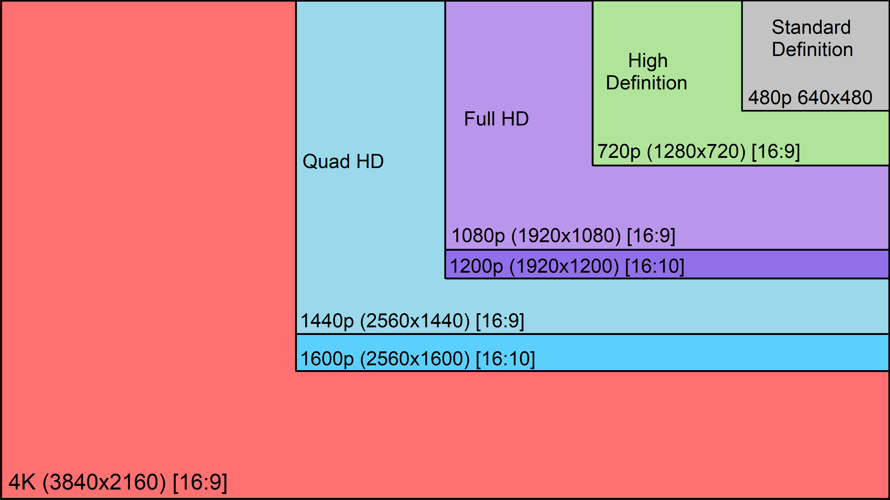
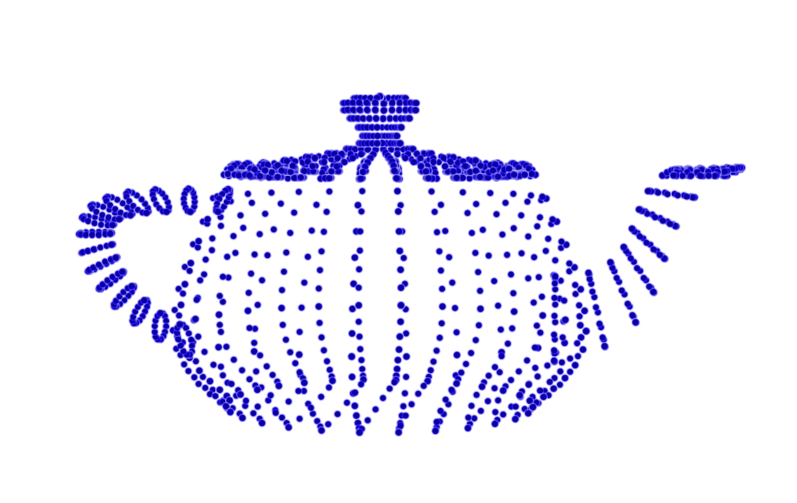
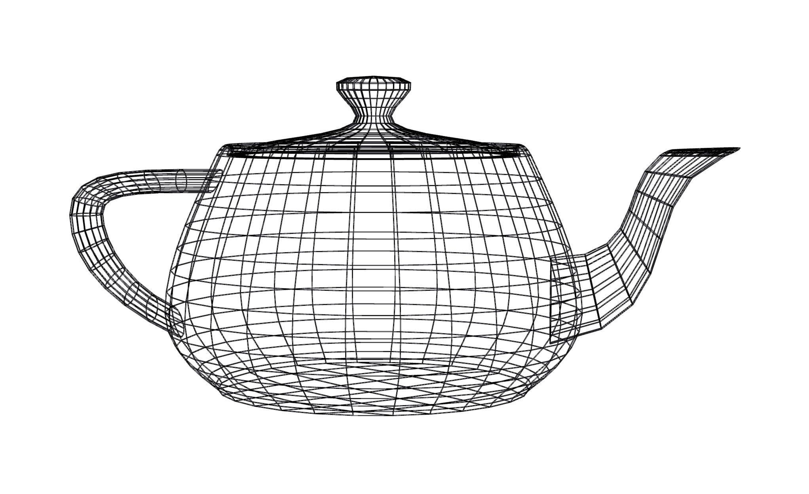
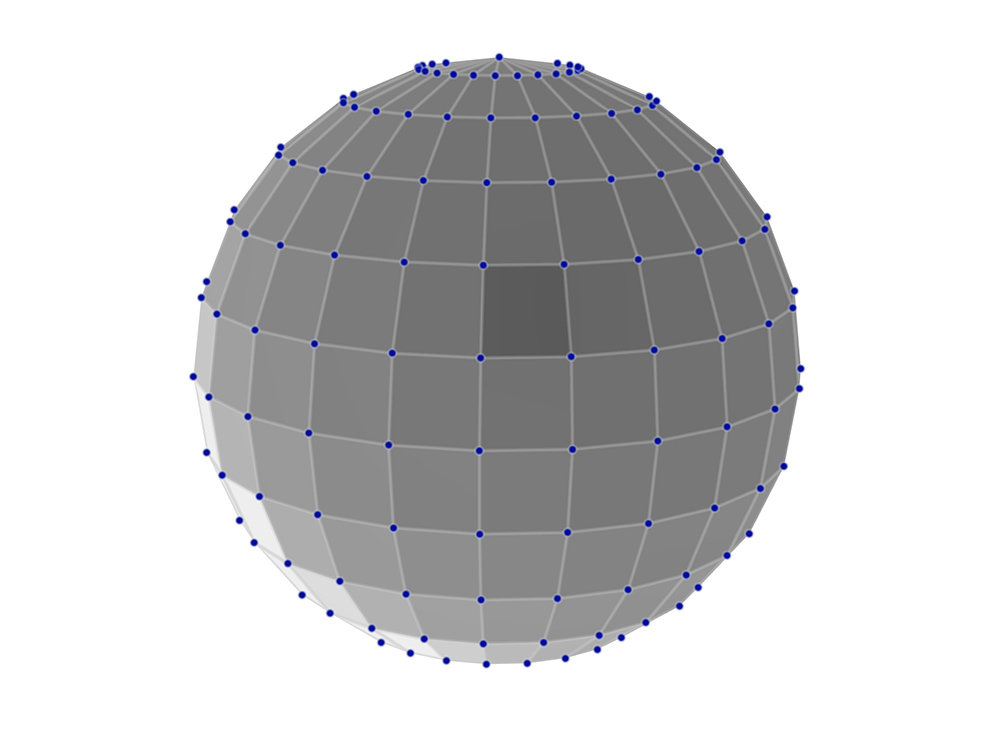
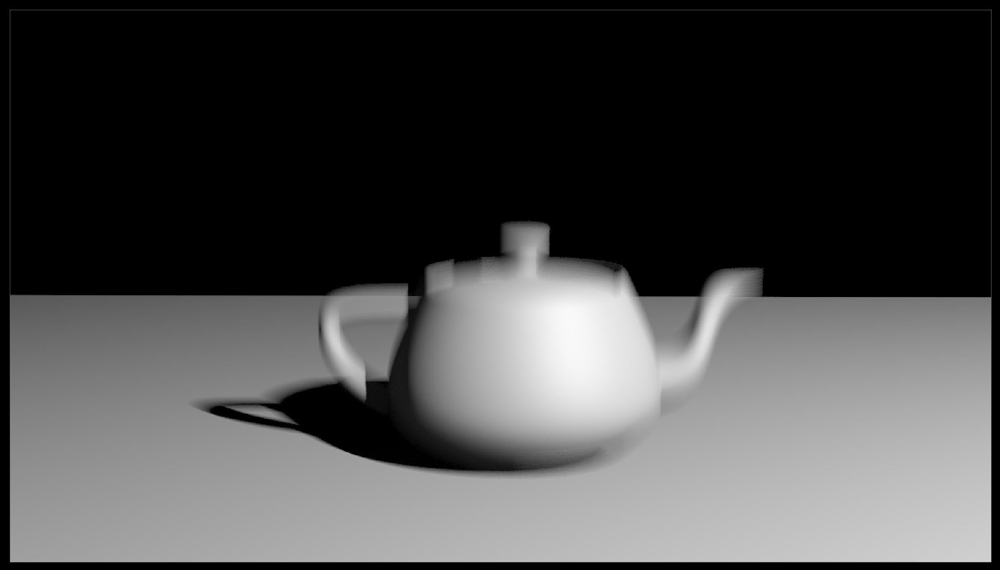
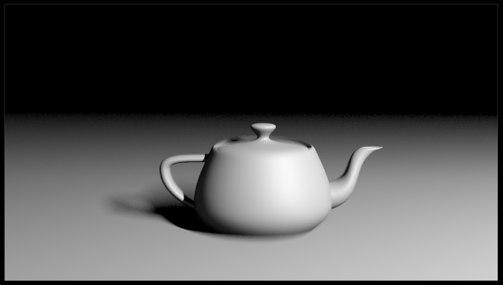
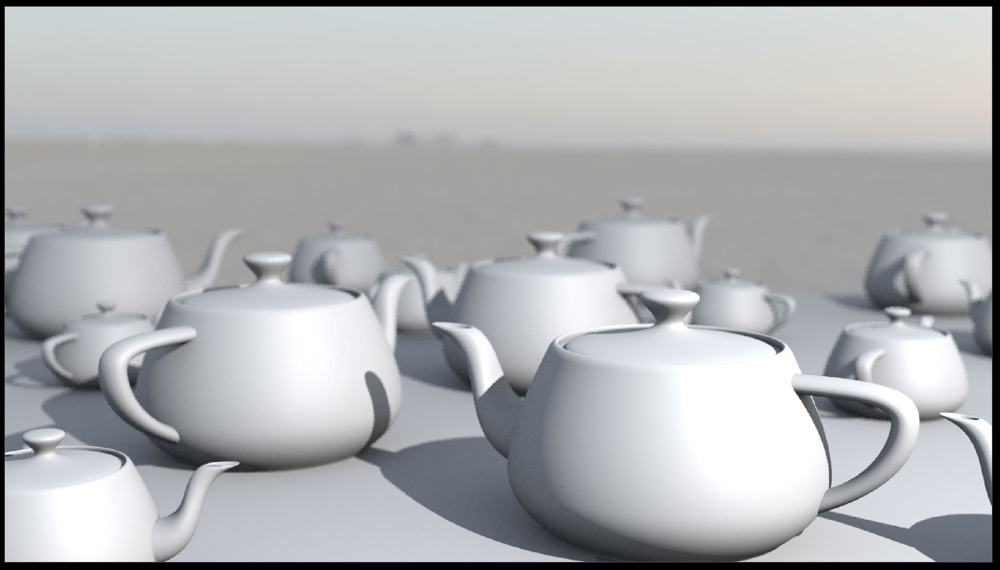
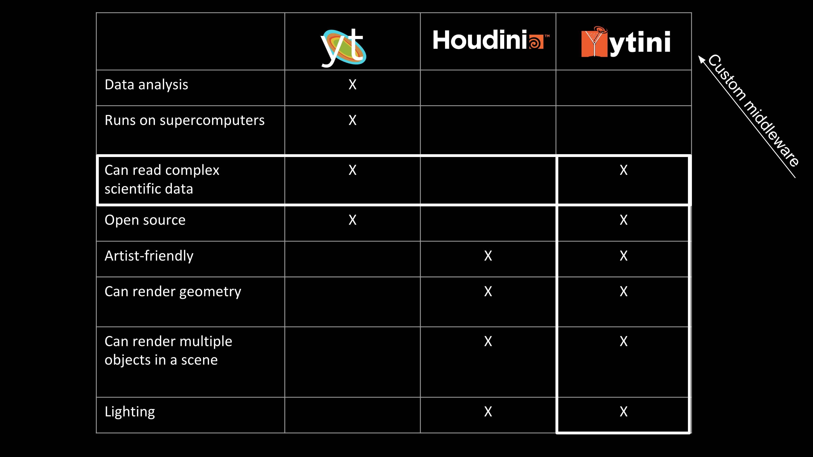

<!-- .slide: class="titleslide" -->

# Data Visualization

## AJ Christensen
## Spring 2019
## Lecture 13

---

## Warm-Up Activity

 1. What is the visualization trying to show?
 1. What are its methods?
 1. What are the strengths / weaknesses?

http://scienceofhiv.org/

---

## Today

 * 3D Computer Graphics
 * 3D Graphics Tools
 * Visual Effects tools

---

## 3D Computer Graphics

 * Composed of virtual 3D objects
 * Often time evolving (animated)
 * Displayed on 2D screens
 * Attempts to simulate photorealism to some extent

---

## Computer Graphics Terms

 * Real-time vs Pre-Rendered graphics
 * Frames vs Timesteps

notes:
real-time graphics refresh the screen faster than the eye perceives, usually at least 30 times a second. Pre-rendered can take all the time in the world.

Frames are individual images that when strung together in time create the illusion of motion. They are the "timesteps" of a movie. But scientific data also have "timesteps" which may not be synchronized with the speed of the movie.

You'll notice in this GIF, the frame rate and the time step rate are different.

---

## Computer Graphics Acronyms

 * VFX - visual effects
 * CGI - computer graphics imagery
 * FPS - frames per second
 * GUI - graphic user interface
 * HUD - heads up display

---

## Common Frame Rates

 * 24 FPS - theatrical films
 * 30 FPS - TV and specialty theaters
 * 48 FPS, 60 FPS - video games, interactive graphics, virtual reality
 * 120 FPS - really good virtual reality

<iframe width="560" height="315" src="https://www.youtube.com/embed/pfiHFqnPLZ4" frameborder="0" allow="accelerometer; autoplay; encrypted-media; gyroscope; picture-in-picture" allowfullscreen></iframe>

notes:
24 fps is considered the absolute minimum necessary frequency so that people don't perceive individual frames.

48 fps is widely considered so fast the human eye can't perceive any separation at all - but 60 fps is safer.

if you watch a TV and it seems distractingly smooth, it's probably doing frame interpolation to make 30fps content play back at 60fps.

This youtube video actually only plays at 60FPS, so the 120 ball is kind of pointless.

---

## Common Resolutions

 * 1024 x 768 - standard definition or SD (3:4)
 * 1920 x 1080 - high definition or HD (16:9)
 * 3840 x 2160 - ultra high definition or UHD or 4k (16:9)

notes:
Often people refer to these formats as 1k or 2k or 4k in graphics, referring to the number of pixels along the horizontal axis.

While these are the most common formats today, there's a long history of a crazy variety of formats. Cinemascope had a ratio of 2.35:1 which was wider than modern wide screens. Also fun fact, it didn't have a resolution because it was film note digital. 

---

## Common File Formats

 * Images: JPG, PNG, TIF, EXR
 * Video: MOV, MP4, AVI
 * Codec: H.264, ProRes, DNxHD

notes:
There are many more formats, but because these are either lossless or extremely space efficient, they are the most popular.

EXR in particular is special because it can store many image layers including DEEP images which store depth information.

ProRes is only available on Apple, and DNxHD is Windows

---

## 3D Geometry

All 3D geometry is represented as:

 * Points

---

## 3D Geometry

All 3D geometry is represented as:

 * Points
 * Edges

---

## 3D Geometry

All 3D geometry is represented as:

 * Points
 * Edges
 * Surfaces

---

## 3D Geometry

All 3D geometry is represented as:

 * Points
 * Edges
 * Surfaces
 * Volumes

---

## 3D Geometry

<iframe src="https://player.vimeo.com/video/169599296?color=949494&title=0&byline=0&portrait=0" width="640" height="360" frameborder="0" allow="autoplay; fullscreen" allowfullscreen></iframe>

notes:
As you can see, all of these can be converted from one to the other. And you can create lots of crazy permutations.

---

## 3D Geometry

Surfaces can be encoded as:

 * Implicit primitives

notes:
primitives are defined by mathematical functions. This sphere is defined by a center position and a radius.

---

## 3D Geometry

Surfaces can be encoded as:

 * Implicit primitives
 * Polygonal Meshes

notes:
Quadrilaterals are a good way to see the flow of geometry, which artists like, but quads can bend.

---

## 3D Geometry

Surfaces can be encoded as:

 * Implicit primitives
 * Polygonal Meshes

notes:
Triangles cannot bend because three points define a plane. So automatic geometry like the stuff you use in science is more often going to be triangles.

---

## 3D Geometry

Surfaces can be encoded as:

 * Implicit primitives
 * Polygonal Meshes
 * NURBS or Bezier Surfaces

notes:
This is a NURBS sphere. You can see the control vertices are floating off the surface. Every patch on the surface is influenced by many of the neighboring points.

---

## 3D Geometry

Surfaces can be encoded as:

 * Implicit primitives
 * Polygonal Meshes
 * NURBS or Bezier Surfaces
 * Subdivision Surfaces

notes:
Subdivision surfaces are like those adaptive volumes we saw last week. You can add detail where you want it.

---

## 3D Geometry

Datasets with many fields called "attributes":

 1. Transform Attributes (translate, rotate, scale)

notes:
These transform attributes are the same for all objects.

---

## 3D Geometry

Datasets with many fields called "attributes":

 1. Transform Attributes (translate, rotate, scale)
 1. Shape Attributes (radius, bumpyness, twistyness)

notes:
shape attributes depend totally on what the shape is.

---

## Rendering

Rendering is the process of flattening a 3-dimensional scene into a flat image.

How do photographic cameras accomplish this?

---

## Rendering

<iframe width="560" height="315" src="https://www.youtube.com/embed/NEzJH-JrAdw" frameborder="0" allow="accelerometer; autoplay; encrypted-media; gyroscope; picture-in-picture" allowfullscreen></iframe>

---

## Photographic Rendering

 1. White light leaves a light source like the sun
 1. The light bounces off an object like a ball or a leaf, and inherits the object's color
 1. Colored light arrives at the camera lens
 1. The camera lens directs the light to a specific location on the CCD sensor, effectively a pixel
 1. The camera processor stores the color of the light at the location of the pixel

If we want to simulate this process in computer graphics software, how many light rays do we need to calculate? 

---

## Photographic Rendering

Trick question, that's WAAAAYYYYY too expensive!

Why?

The light rays that never arrive at the camera are a totally wasted calculation. They don't contribute to the final image at all.

Is there a better way?

---

## Raytracing

Raytracing does this process backwards:

 1. A light ray starts at a camera position and travels toward/through a specific image pixel
 1. The light ray bounces off objects in the scene
 1. If the bounced light arrives at a light, it is recorded as "lit"
 1. If the light ray never arrives at an object or a light, it is recorded as the background color, usually black

This way, we only calculate the path of one light ray for each pixel. It's efficient!

---

## Raytracing

Houdini VEX path tracer

<iframe src="https://player.vimeo.com/video/331150010" width="640" height="412" frameborder="0" allow="autoplay; fullscreen" allowfullscreen></iframe>

---

## Raytracing

Q: How does the renderer handle procedural (formula-driven) geometry?
A: Micropolygon dicing

Q: How does the renderer handle volumetric data that doesn't just "bounce"?
A: Volume ray marching

notes:
The renderer will divide interpolated or dense geometry into smaller and smaller polygons until they are smaller than the image pixel being calculated. These smaller-than-a-pixel polygons are called micropolygons.

In volume ray marching, a ray steps through a volume and accumulates opacity at regular intervals. Each interval generates a bounce to figure out lighting. Once it reaches 100% opacity, it stops ray marching.

--- 

## Shaders

Shaders are code that tells the renderer what something looks like. There are many types:

 1. Vertex Shaders
 1. Geometry Shaders
 1. Fragment or Pixel or Material Shaders
 1. Lens Shaders

---

## The Secrets of Photorealism

---

## The Secrets of Photorealism

 1. Lighting changes everything - use realistic light sources

---

## The Secrets of Photorealism

 1. Lighting changes everything - use realistic light sources
 1. Photographs have motion blur - use a motion blur algorithm

---

## The Secrets of Photorealism

 1. Lighting changes everything - use realistic light sources
 1. Photographs have motion blur - use a motion blur algorithm
 1. Photographs have depth of field - use a depth of field algorithm

---

## The Secrets of Photorealism

 1. Lighting changes everything - use realistic light sources
 1. Photographs have motion blur - use a motion blur algorithm
 1. Photographs have depth of field - use a depth of field algorithm
 1. Scenes need backgrounds - embed your dataset inside a contextual dataset

---

## The Secrets of Photorealism

 1. Lighting changes everything - use realistic light sources
 1. Photographs have motion blur - use a motion blur algorithm
 1. Photographs have depth of field - use a depth of field algorithm
 1. Scenes need backgrounds - embed your dataset inside a contextual dataset
 1. Indirect light is everywhere - use an ambient occlusion algorithm

---

## The Secrets of Photorealism

 1. Lighting changes everything - use realistic light sources
 1. Photographs have motion blur - use a motion blur algorithm
 1. Photographs have depth of field - use a depth of field algorithm
 1. Scenes need backgrounds - embed your dataset inside a contextual dataset
 1. Indirect light is everywhere - use an ambient occlusion algorithm
 1. The world is fractal - increase detail with procedural noise and instancing

---

## OpenGL

Before most computers could show graphics of any kind, several companies began to compete for proprietary formats.

A company called Silicon Graphics stepped in and created an Open Source specification for computer graphics called OpenGL. 

To this day, most software graphics you see are rendered using some version of OpenGL - including the whole Mac operating system.

notes:
Many other open source projects have copied this model, such as OpenCV (computer vision), OpenCL (gpus), and OpenMP (multi-processing).

---

## WebGL

OpenGL is primarily intended for C-style programming.

WebGL implements the same set of tools for rendering through a web browser. This allows us to natively render 3D content on the internet!

---

## Three.js

Three.js is a javascript library that uses WebGL to create interactive 3D graphics that render in web browsers. 

It is meant to be more user-friendly than raw WebGL code.

---

## SketchFab

SketchFab uses WebGL to render YOUR 3D data in a 3D viewport in a web browser. 

[SketchFab.com](https://sketchfab.com)

---

## Scientific Visualization Tools

 * yt
 * ParaView
 * VisIt
 * VMD
 * Vapor

---

## Visual Effects Tools

 * Blender - for developers
 * Maya - for animators
 * Houdini - for dynamics

---

## Scientific Viz Tools VERSUS Visual Effects Tools

---

## Scientific Viz Tools VERSUS Visual Effects Tools

[ytini](www.ytini.com)

[Astroblend](www.astroblend.com)

notes:
several of us at the NCSA worked on ytini so that Houdini could use some of the features of yt natively!

This is also true of Dr. Naiman's work on Astroblend.

---

## Final Project: Presentations!

Your group will have 10 minutes to present your article to the class:

 * You should spend 5 minutes discussing the datasets you found, the story you wanted to tell, and the process you used to create the final article.
 * You should spend 2 minutes discussing what discoveries you made about the dataset while working with it.
 * You should spend 1 minute discussing future directions, or improvements you would like to see.
 * You should spend 2 minutes answering questions from the rest of the class. Your whole group will receive the same grade. You will be graded on whether each team member had a chance to speak, and on how well you addressed each of the prompts above. The final presentation is worth 10 points.

